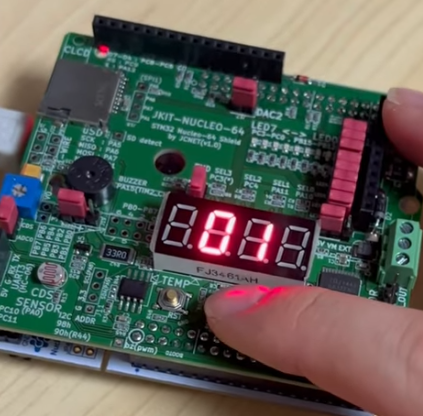

# LAB: LED EXTI & SysTick

**Date**: 2025-10-06

**Author:** Yechan Kim

**Github:** [ YeChanKimm/EC-ycKim-153](https://github.com/YeChanKimm/EC-ycKim-153)

**Demo Video:** [problem 1](https://www.youtube.com/shorts/pOMKRf-N5Rk), 

**PDF version:** 1.1

## Introduction

There were two main objectives in this lab. The first was to control the 7-segment LED using EXTI, and the second was to control it using SysTick. Unlike the previous polling method, where the program continuously checks certain conditions within an infinite loop and handles changes directly, this experiment adopts the interrupt approach, in which changes occur only when a specific trigger is generated.


### Requirement

**Hardware**

- MCU
  
  - NUCLEO-F411RE

- Eval Board

**Software**

- PlatformIO, CMSIS, EC_HAL library

### Documentation

You can download header files used in this lab here: [Header Files](https://github.com/YeChanKimm/EC-ycKim-153/tree/main/include)

Bellow files are newly included:

#### `ecEXTI2.h`

This header file provides functions for configuring and managing external interrupts (EXTI) on an STM32 microcontroller. It allows GPIO pins to trigger interrupt events based on rising, falling, or both edges.

#### `ecSysTick2.h`

This header file defines functions for configuring and controlling the SysTick timer on an STM32 microcontroller. It provides initialization, enabling, disabling, and reset functions for SysTick, as well as a millisecond delay routine based on a global counter (`msTicks`) that increments every SysTick interrupt.

For more details, see my github documentation here: [Library Documentation](https://github.com/YeChanKimm/EC-ycKim-153/blob/main/README.md)

## Problem 1: Counting numbers on 7-Segment using EXTI Button

The objective of this task is to connect a GPIO button and a 7-segment display on the STM board, so that each time the button is pressed, the displayed number increases sequentially, showing values from 0 to 19.


### Configuration

| Digital In for Button (B1) | Digital Out for FND-7-Segment                                                                                        |
| -------------------------- | -------------------------------------------------------------------------------------------------------------------- |
| Digital In                 | Digital Out                                                                                                          |
| PA4                        | PB7,PB6,PB5,PB4,PB3,PB2,PB1,PB0 <br/>('a'~'h', respectively)<br/>PC3,PC4,PA11,PA10<br/>('LED1'~'LED4', respectively) |
| PULL-UP                    | Push-Pull, No PullUp-PullDown, Medium Speed                                                                          |

### Circuit Diagram

Circuit diagram for problem 1 is as follows:


### Procedure

The environment for problem 1 is constructed as follows:


You can download the source code in this link:

You can read the details of the functions used in the lab here: [Library Documentation](https://github.com/YeChanKimm/EC-ycKim-153/blob/main/README.md)

#### Header files

First, the only header file included in the code is `#include "ecSTM32F4v2.h"`. This file declares the header files required for the lab, and explanations of these headers can be found in the documentation at the beginning of the report.

The details of the file is [here](https://github.com/YeChanKimm/EC-ycKim-153/blob/main/include/ecSTM32F4v2.h) and in Appendix.

```c
#include "ecSTM32F4v2.h"
```

Included header files are as follows:

- `ecRCC2.h`

- `ecPinNames.h`

- `ecGPIO2.h`

- `ecEXTI2.h`

- `ecSysTick2.h`

#### Setup()

This function is used to initialize the components required for operation. It initializes the PLL, SysTick, GPIO (button), seven-segment display, and EXTI.

- `RCC_PLL_init()`: Declared in `ecRCC.h`

- `SysTick_init()`: Declared in `ecSysTick2.h`

- `GPIO_init()` : Declared in `ecGPIO2.h`

- `GPIO_pupd()` : Declared in `ecGPIO2.h`

- `seven_seg_FND_init`(): Declared in `ecGPIO2.h`

- `EXTI_init()`: Declared in `ecEXTI2.h`

```c
void setup(void)
{
    //Initialize PLL and Systick
    RCC_PLL_init();
    SysTick_init(1);

    //Initialize Button pin
    GPIO_init(BUTTON_PIN, INPUT);
    GPIO_pupd(BUTTON_PIN, PULL_UP);

    //Initialize 7segment
    seven_seg_FND_init(OUTPUT, PUSH_PULL, NO_PUPD, MEDIUM_SPEED);

    // Set External Interrupt as highst priority 
    EXTI_init(BUTTON_PIN, FALL, 0);
}
```

#### main()

In this function, after performing the setup, the current number is displayed on the 7-segment display within an infinite loop.

- `seven_seg_FND_display_Final()`: Declared in `ecGPIO2.h` 

```c
int main(void) {
    setup();

    while (1) {
        //Display the 10-digit number on the 7 segment
        seven_seg_FND_display_Final(crtNum,selectedFND);

    }
}
```

For displaying 10-digit number, function 

- `seven_seg_FND_display_Final()` 

- `seven_seg_FND_display_Final_OneDigit()`

- `seven_seg_FND_display_Final_TenDigit`

are newly defined in `ecGPIO2.h`.  The detail is as follows:

##### Added Functions

**`seven_seg_FND_display_Final()`**

```c
 void seven_seg_FND_display_Final(uint8_t  num, uint8_t select)
{
    seven_seg_FND_display_TenDigit(num,select);
    delay_ms(5);
    seven_seg_FND_display_OneDigit(num,select);
    delay_ms(5);

}
```

This function is composed of two functions: 

one for the ones place(`seven_seg_FND_display_Final_OneDigit()`) and another for the tens place(`seven_seg_FND_display_Final_OneDigit()`). 

The details of these functions are as follows:

**`seven_seg_FND_display_Final_OneDigit()`**

This function is used to display the ones digit while showing the tens digit on the display.

```c
void seven_seg_FND_display_OneDigit(int  num, int select)
{

    //pin name array; 0~7: pin address, 8~11: display address.
    PinName_t pinsFND[12]={PB_7, PB_6, PB_5, PB_4, PB_3, PB_2, PB_1, PB_0, PC_3, PC_4, PA_11, PA_10};

    //Write LOW on the next board which is for 10-digit. 
    GPIO_write(pinsFND[8+select], LOW);

    //Map the numbers 0 to 9 to the corresponding pins on the 7-segment display.
    uint8_t decoder_number[10]={
        0b00111111,//0
        0b00000110,//1 
        0b01011011,//2 
        0b01001111,//3
        0b01100110,//4
        0b01101101,//5
        0b01111101,//6
        0b00000111,//7
        0b01111111,//8
        0b01101111//9
    };

    //The 1-digit number. 
    int one_digit=num%10;


    for(int i=0; i<8; ++i)
    {
        //Using bitwise operations, write 0 or 1 to the display to show the selected number.
        GPIO_write(pinsFND[7-i], (decoder_number[one_digit]>>i)&0x01);
    }

    //Write HIGH on the board for 1-digit. 
    GPIO_write(pinsFND[9+select], HIGH);


}
```

**`seven_seg_FND_display_Final_TenDigit()`**

This function is used to display the tens digit when showing the tens place on the display.

```c
void seven_seg_FND_display_TenDigit(int  num, int select)
{

    //pin name array; 0~7: pin address, 8~11: display address.
    PinName_t pinsFND[12]={PB_7, PB_6, PB_5, PB_4, PB_3, PB_2, PB_1, PB_0, PC_3, PC_4, PA_11, PA_10};

    //Write LOW on the next board which is for 1-digit. 
    GPIO_write(pinsFND[9+select], LOW);

    //Map the numbers 0 to 9 to the corresponding pins on the 7-segment display.
    uint8_t decoder_number[10]={
        0b00111111,//0
        0b00000110,//1 
        0b01011011,//2 
        0b01001111,//3
        0b01100110,//4
        0b01101101,//5
        0b01111101,//6
        0b00000111,//7
        0b01111111,//8
        0b01101111//9
    };

    //The 10-digit number.
    int ten_digit=num/10;

    for(int i=0; i<8; ++i)
    {
        //Using bitwise operations, write 0 or 1 to the display to show the selected number.
        GPIO_write(pinsFND[7-i], (decoder_number[ten_digit]>>i)&0x01);
    }

    //Write HIGH on the board for 10-digit. 
    GPIO_write(pinsFND[8+select], HIGH);

}
```

#### EXTI4_IRQHandler()

If the button is pressed and an interrupt is triggered and the interupt is on pending, the number displayed on the 7-segment display is updated. After that process, it clears the pending. 

```c
void EXTI4_IRQHandler(void) {

    //Check if the interupt is on pending
    if (is_pending_EXTI(BUTTON_PIN)) {

        //Delay
        for(int i=0; i<500000; i++);

        //If the interupt is triggered(pressing button), update the displayed number
        if ( GPIO_read(BUTTON_PIN)== LOW) { 
            crtNum = (crtNum + 1) % 20; 
            ButtonState=HIGH;
        }

        //Clear the pending
        clear_pending_EXTI(BUTTON_PIN); 

    }

}
```

You can see details of the functions in my library [here](https://github.com/YeChanKimm/EC-ycKim-153/blob/main/README.md).

### 

### Result

The result for problem 1 is as follows:

|   |   |   |   |   |
| ------------------------- | ------------------------- | ------------------------- | ------------------------- | ------------------------- |
|   |   |   |   |   |
|  |  |  |  |  |
|  |  |  |  |  |

You can also see my demo video [here](https://youtube.com/shorts/pOMKRf-N5Rk?si=i6If6S5dmFvFBw7O)

Additionally, `PC4`,`PA11` display are used for the result. 

### Discussion

1. **We can use two different methods to detect an external signal: polling and interrupt. What are the advantages and disadvantages of each approach?**

    Polling is a method in which the CPU continuously checks specific conditions or     signal changes within an infinite loop and handles them directly. It is easy to     implement and offers predictable program flow, but it is inefficient because the CPU     keeps consuming resources even when no event occurs. Moreover, it is not suitable     for real-time applications since it cannot immediately detect input changes while     performing other tasks.

    Interrupt is a mechanism where the hardware notifies the CPU immediately  when     a specific event or signal occurs, prompting the CPU to execute an Interrupt Service     Routine (ISR). This approach is more efficient and power-saving because the CPU     doesn’t need to wait unnecessarily and can respond instantly to events. However, it     is more complex to implement, and when multiple interrupts occur simultaneously,     managing priorities and timing can be challenging.

2. **What would happen if the EXTI interrupt handler does not clear the interrupt pending flag? Check with your code**

    If the pending flag is not cleared, the CPU assumes that the interrupt has not yet     been serviced and repeatedly calls the same interrupt, preventing other algorithms     from executing. As a result, the interrupt can completely occupy the CPU, potentially     causing the entire system to freeze. Furthermore, if an error occurs for this reason, it     may not appear critical on the surface, but it can ultimately lead to the MCU itself     stopping operation.

       

    bellow is my code:

```c
    void EXTI4_IRQHandler(void) {

    //Check if the interupt is on pending
    if (is_pending_EXTI(BUTTON_PIN)) {

        //Delay
        for(int i=0; i<500000; i++);

        //If the interupt is triggered(pressing button), update the displayed number
        if ( GPIO_read(BUTTON_PIN)== LOW) { 
            crtNum = (crtNum + 1) % 20; 
            ButtonState=HIGH;
        }

        //Clear the pending
        clear_pending_EXTI(BUTTON_PIN); 

    }

}
```

Here, if I don't clear the pending, my system going to be stopped. 

For all interrupts and algorithms to operate properly, the pending flag must be cleared after executing a specific interrupt. The flow of an ideal algorithm is as follows:


## Problem 2: Counting numbers on 7-Segment using SysTick


The objective of this task is to use SysTick as an interrupt to update the number displayed on the 7-segment display. The number increases by one every second, and when the button is pressed, it resets to zero.

### Configuration

| Digital In for Button (B1) | Digital Out for FND-7-Segment                                                                           |
| -------------------------- | ------------------------------------------------------------------------------------------------------- |
| Digital In                 | Digital Out                                                                                             |
| PA4                        | PB7,PB6,PB5,PB4,PB3,PB2,PB1,PB0 <br/>('a'~'h', respectively)<br/>PA10<br/>('LED1'~'LED4', respectively) |
| PULL-UP                    | Push-Pull, No PullUp-PullDown, Medium Speed                                                             |

### Circuit Diagram

The circuit diagram for problem 2 is as follows:


### Procedure

The environment for problem 2 is constructed as follows:


You can download the source code in this link:

You can read the details of the functions used in the lab here: [Library Documentation](https://github.com/YeChanKimm/EC-ycKim-153/blob/main/README.md)

#### Header files

First, the only header file included in the code is `#include "ecSTM32F4v2.h"`. This file declares the header files required for the lab, and explanations of these headers can be found in the documentation at the beginning of the report.

The details of the file is [here](https://github.com/YeChanKimm/EC-ycKim-153/blob/main/include/ecSTM32F4v2.h) and in Appendix.

```c
#include "ecSTM32F4v2.h"
```

Included header files are as follows:

- `ecRCC2.h`

- `ecPinNames.h`

- `ecGPIO2.h`

- `ecEXTI2.h`

- `ecSysTick2.h`

#### Setup()

This function is used to initialize the components required for operation. It initializes the PLL, SysTick, GPIO (button), seven-segment display, and EXTI. 

To update current number, the period of the SysTick is defined as 1msec, and I gave the delay for 1 sec. 

```c
// Initialiization 
void setup(void)
{
    //Initialize PLL and Systick
    RCC_PLL_init();
    SysTick_init(1);
    //Initialize Button pin
    GPIO_init(BUTTON_PIN, INPUT);
    GPIO_pupd(BUTTON_PIN, PULL_UP);
    //Initialize 7segment
    seven_seg_FND_init(OUTPUT, PUSH_PULL, NO_PUPD, MEDIUM_SPEED);

    // Set External Interrupt as highst priority 
    EXTI_init(BUTTON_PIN, FALL, 0);
}
```

- `RCC_PLL_init()`: Declared in `ecRCC.h`

- `SysTick_init()`: Declared in `ecSysTick2.h`

- `GPIO_init()` : Declared in `ecGPIO2.h`

- `GPIO_pupd()` : Declared in `ecGPIO2.h`

- `seven_seg_FND_init`(): Declared in `ecGPIO2.h`

- `EXTI_init()`: Declared in `ecEXTI2.h`


#### Global Variables

To display the numbers on `PA_10`, global variable is defined as follows:

```c
//pin name array; 0~7: pin address, 8~11: display address.
PinName_t pinsFND[12]={PB_7, PB_6, PB_5, PB_4, PB_3, PB_2, PB_1, PB_0, PC_3, PC_4, PA_11, PA_10};


uint8_t crtNum=0;

//PA_10 Display
int selectedFND=3;
```

`int selectedFND` is variable for 7segment display, and 4th display is `PA_10`.  


#### main()

In the main function, the SysTick interrupt was used to update the current number by applying a one-second delay each time and then updating the current time accordingly.

```c
int main(void) {
    setup();
    //SysTick_counter();
    while (1) {

        //If 1sec is passed, update the current number. 
        delay_ms(1000); 
        crtNum = (crtNum + 1) % 10; 
        seven_seg_FND_display(crtNum,selectedFND);

    }
}
```

- `seven_seg_FND_display()`: Declared in `ecGPIO2.h`

The detail of `seven_seg_FND_display()` is as follows:

```c
void seven_seg_FND_display(uint8_t  num, uint8_t select)
{

    //pin name array; 0~7: pin address, 8~11: display address.
    PinName_t pinsFND[12]={PB_7, PB_6, PB_5, PB_4, PB_3, PB_2, PB_1, PB_0, PC_3, PC_4, PA_11, PA_10};

    //Write HIGH on selected display board. 
    GPIO_write(pinsFND[8+select], HIGH);

    //Map the numbers 0 to 9 to the corresponding pins on the 7-segment display.
    uint8_t decoder_number[10]={
        0b00111111,//0
        0b00000110,//1 
        0b01011011,//2 
        0b01001111,//3
        0b01100110,//4
        0b01101101,//5
        0b01111101,//6
        0b00000111,//7
        0b01111111,//8
        0b01101111//9
    };

    //Using bitwise operations, write 0 or 1 to the display to show the selected number.
    for(int i=0; i<8; ++i)
    {
        GPIO_write(pinsFND[7-i], (decoder_number[num]>>i)&0x01);
    }

}
```

#### EXTI4_IRQHandler()

In the EXTI handler, an algorithm was implemented to reset the number to zero when the button is pressed. The reason the current number is initialized to 9 within this function when the interrupt occurs is that the main function immediately updates the current number afterward, so the value prior to zero must be set as the current number.

```c
void EXTI4_IRQHandler(void) {

    //Check if the interupt is on pending
    if (is_pending_EXTI(BUTTON_PIN)) {


        //If the interupt is triggered(pressing button), initialize the number to 0. 
        if ( GPIO_read(BUTTON_PIN)== LOW) { 
            crtNum = 9;
            ButtonState=HIGH;
            //delay_ms(1000);
        }

        //Clear the pending
        clear_pending_EXTI(BUTTON_PIN); 

    }

}
```

You can see details of the functions in my library [here](https://github.com/YeChanKimm/EC-ycKim-153/blob/main/README.md).

### Result

|  |  |  |  |  |
| ------------------------ | ------------------------ | ------------------------ | ------------------------ | ------------------------ |
|  |  |  |  |  |

You can see the demo video [here](https://youtube.com/shorts/wgsxFjTmwos?si=6SdywOwq21E-vcJd)


### Discussion

The most important aspect of this task was generating interrupts using SysTick. Initially, I attempted to use the global timer `msTicks` directly as a timer, but since its basic unit is milliseconds, it was difficult to control precisely. After various trials, I devised an algorithm that sets the SysTick period to 1 millisecond and introduces a one-second delay after each completed period.

Additionally, since the current number is updated once every second within the infinite loop, setting the current number to 0 when the button is pressed caused it to immediately change to 1 due to the update cycle. To prevent this, the number was set to 9 when the button was pressed, which resulted in the system operating correctly.


## Reference

- [STM32 - Clock, Timer 구현 (SysTick, Timer 사용)](https://insoobaik.tistory.com/632)

- [STM32 - EXTI (External Interrupt 외부 인터럽트) 이론](https://insoobaik.tistory.com/609)


## Appendix

**`LAB_EXTI.c`**(problem 1)

```c
#include "ecSTM32F4v2.h"

#define BUTTON_PIN PA_4

// Initialiization 
void setup(void)
{
	//Initialize PLL and Systick
	RCC_PLL_init();
	SysTick_init(1);
	
	//Initialize Button pin
	GPIO_init(BUTTON_PIN, INPUT);
	GPIO_pupd(BUTTON_PIN, PULL_UP);

	//Initialize 7segment
    seven_seg_FND_init(OUTPUT, PUSH_PULL, NO_PUPD, MEDIUM_SPEED);

	// Set External Interrupt as highst priority 
	EXTI_init(BUTTON_PIN, FALL, 0);
}

//Initializing current number, display, buttonstate
int crtNum=0;
int selectedFND=1;
int ButtonState=LOW;


int main(void) {
	setup();
	
	while (1) {
		//Display the 10-digit number on the 7 segment
		seven_seg_FND_display_Final(crtNum,selectedFND);
		
	}
}


//EXTI for Pin 13
void EXTI4_IRQHandler(void) {
	
	//Check if the interupt is on pending
	if (is_pending_EXTI(BUTTON_PIN)) {
		
		//Delay
		for(int i=0; i<500000; i++);

		//If the interupt is triggered(pressing button), update the displayed number
		if ( GPIO_read(BUTTON_PIN)== LOW) { 
            crtNum = (crtNum + 1) % 20; 
            ButtonState=HIGH;
        }

		//Clear the pending
		clear_pending_EXTI(BUTTON_PIN); 
		
	}

}
```


**`LAB_EXTI_SysTick.c`**(problem 2)

```c
#include "ecSTM32F4v2.h"
#define BUTTON_PIN PA_4
ButtonState=HIGH;

// Initialiization 
void setup(void)
{
	//Initialize PLL and Systick
	RCC_PLL_init();
	SysTick_init(1);
	//Initialize Button pin
	GPIO_init(BUTTON_PIN, INPUT);
	GPIO_pupd(BUTTON_PIN, PULL_UP);
	
	//Initialize 7segment
    seven_seg_FND_init(OUTPUT, PUSH_PULL, NO_PUPD, MEDIUM_SPEED);
	
	//Initialize EXTI
	EXTI_init(BUTTON_PIN, FALL, 0);
}

uint8_t crtNum=0;

//PA_10 Display
int selectedFND=3;


int main(void) {
	setup();
	//SysTick_counter();
	while (1) {

		//If 1sec is passed, update the current number. 
        delay_ms(1000); 
		crtNum = (crtNum + 1) % 10; 
        seven_seg_FND_display(crtNum,selectedFND);
	
	}
}


void EXTI4_IRQHandler(void) {
	
	//Check if the interupt is on pending
	if (is_pending_EXTI(BUTTON_PIN)) {
		

		//If the interupt is triggered(pressing button), initialize the number to 0. 
		if ( GPIO_read(BUTTON_PIN)== LOW) { 
            crtNum = 9;
            ButtonState=HIGH;
			//delay_ms(1000);
        }

		//Clear the pending
		clear_pending_EXTI(BUTTON_PIN); 
		
	}

}


```


**`ecSTM32F4v2.h`**(Header file)

```c
//ecSTM32F4v2.h
/**
******************************************************************************
* @course   Embedded Controller- HGU
* @author	Yechan Kim
* @brief	STM32F411 Library for EC
*
******************************************************************************
*/

#ifndef __EC_STM_H
#define __EC_STM_H

// STM built-In Library
#include "stm32f4xx.h"
//#include "stm32f411xe.h"
//#include "math.h"

// EC course Library
#include "ecPinNames.h"
#include "ecRCC2.h"
#include "ecGPIO2.h"
#include "ecEXTI2.h"
#include "ecSysTick2.h"
//#include "ecTIM2.h"
//#include "ecPWM2.h"
//#include "ecStepper2.h"
//#include "ecADC2.h"
//#include "ecUART2.h"

#endif
```
