# LAB: GPIO Digital InOut 7-segment

**Date:** 2025-09-23

**Author:** Yechan Kim

**Github:** https://github.com/YeChanKimm/EC-ycKim-153

**Demo Video:** https://youtube.com/shorts/f7NNSKGHxVA?si=V68y1VH4_x-96YjP

**PDF version:** 1.1


## Introduction

In this lab, the goal is to create a simple program to control a 7-segment display to show a decimal number (0~9) that increases by pressing a push-button.

The flowchart for the overall lab is as follows:


### Requirement

**Hardware**

- MCU
  - NUCLEO-F411RE
- Eval Board

**Software**

- PlatformIO, CMSIS, EC_HAL library


### Documentation

You can download header files used in this lab here: [Header Files Download](https://github.com/YeChanKimm/EC-ycKim-153/tree/main/include)

Bellow files are included:

#### `ecGPIO2.h`

It implements GPIO initialization and control functions (mode, speed, type, pull-up/down, read, write) for STM32F4 using pin-to-port mapping

####  `ecPinNames.h`

It combines the port name and pin number into a single variable and maps it to the actual register address.

#### `ecRCC2.h`

It enables clock of the each port. 


For more details, see my github documentation here: [Library Documentation](https://github.com/YeChanKimm/EC-ycKim-153/blob/main/README.md)


## Exercise

| **Port/Pin**   | **Description**              | **Register setting**          |
| -------------- | ---------------------------- | ----------------------------- |
| Port A Pin 5   | Clear Pin5 mode              | GPIOA->MODER &=~(3<<(5*2))    |
| Port A Pin 5   | Set Pin5 mode = Output       | GPIOA->MODER \|=(1<<(5*2))    |
| Port A Pin 6   | Clear Pin6 mode              | GPIOA->MODER &=~(3<<(6*2))    |
| Port A Pin 6   | Set Pin6 mode = Output       | GPIOA->MODER \|=(1<<(5*2))    |
| Port A Pin Y   | Clear PinY mode              | GPIOA->MODER &=~(1<<(Y*2))    |
| Port A Pin 5~9 | Clear Pin5~9 mode            | GPIOA->MODER &=~(1023<<(5*2)) |
|                | Set Pin5~9 mode = Output     | GPIOA->MODER \|=(1023<<(5*2)) |
| Port X Pin Y   | Clear Pin Y mode             | GPIOX->MODER &=~(1<<(Y*2))    |
|                | Set Pin Y mode = Output      | GPIOX->MODER \|=(1<<(Y*2n3))  |
| Port A Pin5    | Set Pin5 otype=push-pull     | GPIOA->OTYPER \|=(1<<5)       |
| Port A PinY    | Set PinY otype=push-pull     | GPIOA->OTYPER \|=(1<<Y)       |
| Port A Pin5    | Set Pin5 ospeed=Fast         | GPIOA->OSPEEDR \|=(2<<5)      |
| Port A PinY    | Set PinY ospeed=Fast         | GPIOA->OSPEEDR \|=(2<<Y)      |
| Port A Pin 5   | Set Pin5 PUPD=no pullup/down | GPIOA->PUPDR\|=(0<<(5*2))     |
| Port A Pin Y   | Set PinY PUPD=no pullup/down | GPIOA->PUPDR\|=(0<<(Y*2))     |


## Problem 0: Connection of 7-Segment Display and Decoder

For problem 0, the goal is to display one number on 7 segment without button. This process is [Tutorial: 7-Segment Display](https://ykkim.gitbook.io/ec/ec-course/tutorial/tutorial-7segment-display)


### Configuration

The configuration of the registers are as follows:

| Digital Out:  7-Segment display number         | Digital Out: Select  7-Segment display |
| ---------------------------------------------- | -------------------------------------- |
| Digital Out                                    | Digital Out                            |
| PB_7, PB_6, PB_5, PB_4, PB_3, PB_2, PB_1, PB_0 | PC_3, PC_4, PA_11, PA_10               |
| Push-Pull                                      | Push-Pull                              |


Details of  the configuration of 7-segment pin and displays are as follows:


### Procedure

The environment for problem 0 is constructed as follows:


You can download the code this link: 

You can read the details of the function used in the lab here: [Library Documentation](https://github.com/YeChanKimm/EC-ycKim-153/blob/main/README.md)


**``Header file``**

First, the only header file included in the code is `#include "ecSTM32F4v2.h"`.  This file declares the header files required for the lab, and explanations of these headers can be found in the documentation at the beginning of the report. 

The details of the file is [here](https://github.com/YeChanKimm/EC-ycKim-153/blob/main/include/ecSTM32F4v2.h) and in Appendix. 

```c
#include "ecSTM32F4v2.h"
```


**`setup()`**

A comprehensive register initialization function was built using the previously defined functions. 

Used function:

- `RCC_HSI_init()`:  Declared in `ecRCC2.h` . 
- `seven_seg_FND_init()`: Declared in `ecGPIO2.h` 

```c
void setup(void){
    // Intialize System Clock
    RCC_HSI_init();
    
    //Initialize registers following the register configuration
    seven_seg_FND_init(OUTPUT, PUSH_PULL, NO_PUPD, MEDIUM_SPEED); 
};
```


**`main()`**

Using the declared functions, display the number on the selected display.

Used function:

` seven_seg_FND_display()`: Declared in `ecGPIO2.h` 

```c
int main(void) {
    
    //Initialize the system
    setup();

    //Selected number and display
    uint8_t numDisplay=4;
    uint8_t selectFND=3;

    //Display the number on the selected display
    while (1) {
        seven_seg_FND_display(numDisplay,selectFND);
    }
}
```


For this lab, constant values for setting registers  and two functions is added to `ecGPIO2.h`


#### Added Constants

```c
#define PULL_DOWN 1
#define PULL_UP 2
#define NO_PUPD 0
#define PUSH_PULL 0
#define OPEN_DRAIN 1
#define LOW_SPEED 0
#define MEDIUM_SPEED 1
#define FAST_SPEED 2
#define HIGH_SPEED 3
```


#### Added Functions

- **`seven_seg_FND_init()`**
- **`seven_seg_FND_display()`**


Bellow is explanations:


**`seven_seg_FND_init()`**

Bellow is `seven_seg_FND_init()` which initialize each 7 segment displays and pins bellow things:

- mode
- output type
- pull up/ pull down
- output speed

The address of the display and the pins are declared in array form. 

Location:  `ecGPIO2.h`

```c
void seven_seg_FND_init(int mode, int otype, int pupd, int ospeed){	
   
    //pin name array; 0~7: pin address, 8~11: display address. 
    PinName_t pinsFND[12]={PB_7, PB_6, PB_5, PB_4, PB_3, PB_2, PB_1, PB_0, PC_3, PC_4, PA_11, PA_10};
    
    for (int i=0; i<8; ++i) 
    {
        //Set 7 segment pins
        GPIO_init(pinsFND[i], mode);
        GPIO_otype(pinsFND[i], otype);
		GPIO_pupd(pinsFND[i], pupd);
		GPIO_ospeed(pinsFND[i], ospeed);
    }    
   
    for(int i=8; i<12; ++i) 
    {
        //Set 7 segment displays
        GPIO_init(pinsFND[i], mode);
        GPIO_otype(pinsFND[i], otype);
		GPIO_pupd(pinsFND[i], pupd);
		GPIO_ospeed(pinsFND[i], ospeed);
      }
}
```


**`seven_seg_FND_display()`**

Using bitwise operations, a number from 0 to 9 is shown on the selected display. The address of the display and the pins are declared in array form. 

Location: `ecGPIO2.h`

```c
void seven_seg_FND_display(uint8_t  num, uint8_t select)
{
	//pin name array; 0~7: pin address, 8~11: display address. 
    PinName_t pinsFND[12]={PB_7, PB_6, PB_5, PB_4, PB_3, PB_2, PB_1, PB_0, PC_3, PC_4, PA_11, PA_10};
    
    //Write HIGH on selected display board. 
    GPIO_write(pinsFND[8+select], HIGH);
    
    //Map the numbers 0 to 9 to the corresponding pins on the 7-segment display.
    uint8_t decoder_number[10]={
        0b00111111,//0
        0b00000110,//1 
        0b01011011,//2 
        0b01001111,//3
        0b01100110,//4
        0b01101101,//5
        0b01111101,//6
        0b00000111,//7
        0b01111111,//8
        0b01101111//9
    };

    //Using bitwise operations, write 0 or 1 to the display to show the selected number.
    for(int i=0; i<8; ++i)
    {
        GPIO_write(pinsFND[7-i], (decoder_number[num]>>i)&0x01);
    }
}


```


## Problem 1: Display a Number with Button Press

For problem 1, the goal is to change the displayed number when the button is pressed. 


### Configuration

The configuration of the registers are as follows:

| Digital In for Button (B1) | Digital Out for 7-Segment                                    |
| -------------------------- | ------------------------------------------------------------ |
| Digital In                 | Digital Out                                                  |
| PA4                        | PB7,PB6,PB5,PB4,PB3,PB2,PB1,PB0 ('a'~'h', respectively) PC3,PC4,PA11,PA10 ('FND_0'~FND_3, respectively) |
| PULL-UP                    | Push-Pull, No Pull-up-Pull-down, Medium Speed                |


Details of  the configuration of 7-segment pin and displays are as follows:


### Procedure

The environment for problem 1 is constructed as follows:


You can download the code this link: [Code Link](https://github.com/YeChanKimm/EC-ycKim-153/blob/main/lab/LAB_GPIO_7segment_22100153_YechanKim/LAB_GPIO_7segment.c)

You can read the details of the function used in the lab here: [Library Documentation](https://github.com/YeChanKimm/EC-ycKim-153/blob/main/README.md)


#### ``Header file``

First, the only header file included in the code is `#include "ecSTM32F4v2.h"`.  This file declares the header files required for the lab, and explanations of these headers can be found in the documentation at the beginning of the report.

```c
#include "ecSTM32F4v2.h"
```

Details:  [ecSTM32F4v2.h](https://github.com/YeChanKimm/EC-ycKim-153/blob/main/include/ecSTM32F4v2.h)


#### `setup()`

A comprehensive register initialization function was built using the previously defined functions. 

Used function:

- `RCC_HSI_init()`:  Declared in [ecRCC2.h](https://github.com/YeChanKimm/EC-ycKim-153/blob/main/include/ecRCC2.h) 
- `seven_seg_FND_init()`: Declared in [ecGPIO2.h](https://github.com/YeChanKimm/EC-ycKim-153/blob/main/include/ecGPIO2.h) 

```c
void setup(void){
    // Intialize System Clock
    RCC_HSI_init();

    //Initialize registers: Output mode, Push-Pull, No Pull up/Pull down, Medium Speed
    seven_seg_FND_init(OUTPUT, PUSH_PULL, NO_PUPD, MEDIUM_SPEED); 
};
```


#### `main()`

After initializing the current and previous button states, the program detects button press edges in an infinite loop. If the button is pressed, it increments the currently displayed number by one and updates the display. Then, it assigns the current button state to the previous state to update the status. Additionally, a delay is added within the infinite loop to prevent system instability.

Used function:

` seven_seg_FND_display()`: [Declared in ecGPIO2.h](https://github.com/YeChanKimm/EC-ycKim-153/blob/main/include/ecGPIO2.h) 

```c
int main(void) {
    setup();
    
    //Board to display increasing numbers
    uint8_t selectFND=0;

    //Initialize current and previous button state
    int buttonState=LOW;
	int prev_buttonState=HIGH;

    //Set initial number as 0
    int crtNum=0;
    
    while (1) {

        //Read the button register to check if the button is pressed
        buttonState=GPIO_read(BUTTON_PIN);
        
        //When curren state is 'pressed' previous state is 'unpressed'(Edge), increase the number and display it
        if(buttonState==LOW && prev_buttonState==HIGH)
        {
            seven_seg_FND_display(crtNum,selectFND);
            crtNum=(crtNum+1)%10;
        }    
        
        //Make curren button state as previous one
        prev_buttonState=buttonState;

        //Delay the system for stabilization 
        for(int i=0; i<10000; ++i);
    }
}
```


### Result

Result is as follows:

[Demo Video Link](https://youtube.com/shorts/f7NNSKGHxVA?si=V68y1VH4_x-96YjP)

| 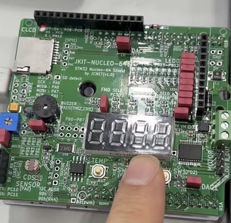  | 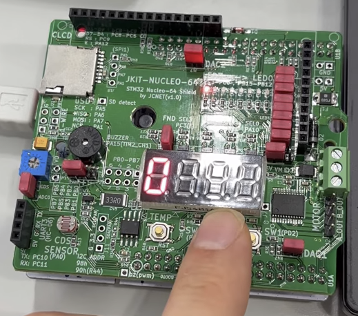  | 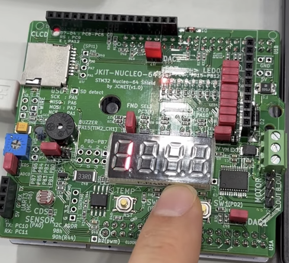 |
| ----------------------------------------------------------- | ----------------------------------------------------------- | ---------------------------------------------------------- |
| 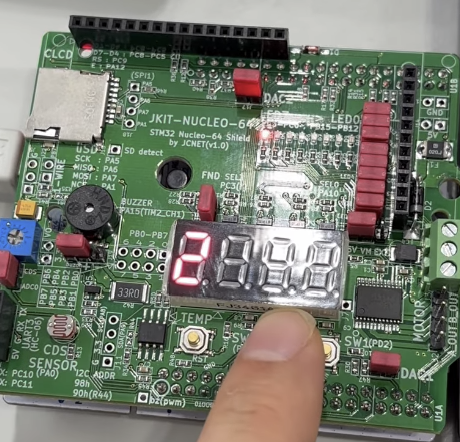  | 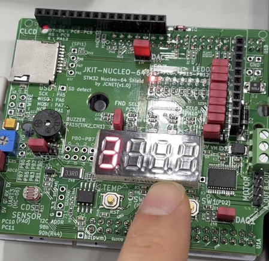  | 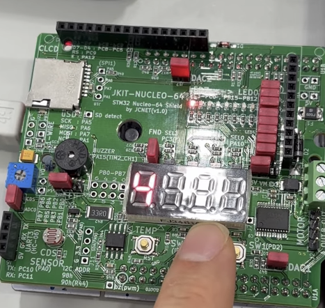 |
| 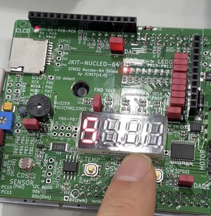  | 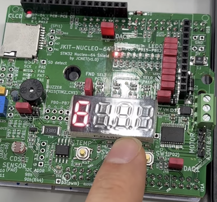  | 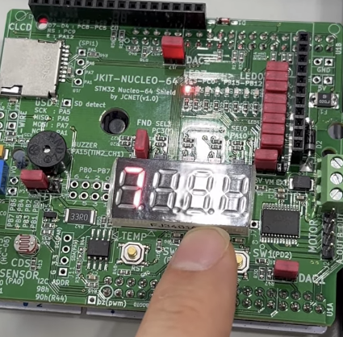 |
| 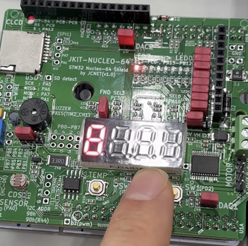 | 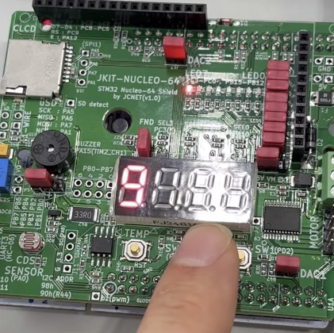 |                                                            |


### Discussion

1. **Analyze the result and explain any other necessary discussion.**

   As initially intended, the program successfully increased the number on the display when the button was pressed. Since the function was executed within an infinite loop, there was a possibility of control issues, but the MCU was managed in two ways:
   
   - Edge Detection
   
     By declaring the current and previous button states, the program used the exact button press moment as the condition for executing the function within the infinite loop. This prevented the problem of the function being triggered multiple times.
   
   - Delay
   
     By using an empty for-loop to introduce a delay, the repetition speed of the infinite loop was reduced, which allowed the button to be controlled as desired.

2. **Draw the truth table for the BCD 7-segment decoder with the 4-bit input.**

   Decoder configuration is as follows:

   

   Truth Tabla is as follows:

   |      | LT   | RBI  | D    | C    | B    | A    | BI/RBO | a    | b    | c    | d    | e    | f    | g    |
   | ---- | ---- | ---- | ---- | ---- | ---- | ---- | ------ | ---- | ---- | ---- | ---- | ---- | ---- | ---- |
   | 0    | H    | H    | L    | L    | L    | L    | H      | L    | L    | L    | L    | L    | L    | H    |
   | 1    | H    | X    | L    | L    | L    | H    | H      | H    | L    | L    | H    | H    | H    | H    |
   | 2    | H    | X    | L    | L    | H    | L    | H      | L    | L    | H    | L    | L    | H    | L    |
   | 3    | H    | X    | L    | L    | H    | H    | H      | L    | L    | L    | L    | H    | H    | L    |
   | 4    | H    | X    | L    | H    | L    | L    | H      | H    | L    | L    | H    | H    | L    | L    |
   | 5    | H    | X    | L    | H    | L    | H    | H      | L    | H    | L    | L    | H    | L    | L    |
   | 6    | H    | X    | L    | H    | H    | L    | H      | H    | H    | L    | L    | L    | L    | L    |
   | 7    | H    | X    | L    | H    | H    | H    | H      | L    | L    | L    | H    | H    | H    | H    |
   | 8    | H    | X    | H    | L    | L    | L    | H      | L    | L    | L    | L    | L    | L    | L    |
   | 9    | H    | X    | H    | L    | L    | H    | H      | L    | L    | L    | H    | H    | L    | L    |

   

3. **What are the common cathode and common anode of 7-segment display?**

   In a 7-segment display, the terms common cathode and common anode describe how the LED segments are connected internally. In a common cathode display, all the cathodes (negative terminals) of the LED segments are tied together and connected to ground, so each segment is lit by applying a HIGH voltage to its anode. In contrast, in a common anode display, all the anodes (positive terminals) are connected together and tied to a supply voltage, and each segment is lit by pulling its cathode LOW. These two configurations determine whether the active state for illuminating a segment is logic HIGH (common cathode) or logic LOW (common anode).


4. **Does the LED of a 7-segment display (common anode) pin turn ON when 'HIGH' is given to the LED pin from the MCU?**

   No. in a common anode 7-segment display, the LED segment turns ON only when the MCU outputs a LOW signal to the segment pin, because the anode is already tied to Vcc and current flows from Vcc through the LED to the MCU pin acting as ground. If the MCU outputs HIGH, no potential difference exists, so the LED remains OFF.

   


## Reference

[Dev C++ 프로그램 ld returned 1 exit status 에러 해결](https://hunji-up.tistory.com/28)


## Appendix

**`TU_GPIO_7Segment.c`**

```c
#include "ecSTM32F4v2.h"


void setup(void){
    // Intialize System Clock
    RCC_HSI_init();

    //Initialize registers
    seven_seg_FND_init(OUTPUT, PUSH_PULL, NO_PUPD, MEDIUM_SPEED); 
};

int main(void) {
    
    //Initialize the system
    setup();

    //Selected number and display
    uint8_t numDisplay=7;
    uint8_t selectFND=3;

    //Display the number on the selected display
    while (1) {
        seven_seg_FND_display(numDisplay,selectFND);
    }
}
```


**`LAB_GPIO_7segment.c`**

```c
#include "ecSTM32F4v2.h"

//The address of the button
#define BUTTON_PIN PA_4


void setup(void){
    // Intialize System Clock
    RCC_HSI_init();

    //Initialize registers: Output mode, Push-Pull, No Pull up/Pull down, Medium Speed
    seven_seg_FND_init(OUTPUT, PUSH_PULL, NO_PUPD, MEDIUM_SPEED); 
};

int main(void) {
    setup();
    
    //Board to display increasing numbers
    uint8_t selectFND=0;

    //Initialize current and previous button state
    int buttonState=LOW;
	int prev_buttonState=HIGH;

    //Set initial number as 0
    int crtNum=0;
    
    while (1) {

        //Read the button register to check if the button is pressed
        buttonState=GPIO_read(BUTTON_PIN);
        
        //When curren state is 'pressed' previous state is 'unpressed'(Edge), increase the number and display it
        if(buttonState==LOW && prev_buttonState==HIGH)
        {
            
            seven_seg_FND_display(crtNum,selectFND);
            crtNum=(crtNum+1)%10;
        }    
        
        //Make curren button state as previous one
        prev_buttonState=buttonState;

        //Delay the system for stabilization 
        for(int i=0; i<10000; ++i);
    }
}
```


**`ecSTM32F4v2.h`**

```c
//ecSTM32F4v2.h
/**
******************************************************************************
* @course   Embedded Controller- HGU
* @author	Yechan Kim
* @brief	STM32F411 Library for EC
*
******************************************************************************
*/

#ifndef __EC_STM_H
#define __EC_STM_H

// STM built-In Library
#include "stm32f4xx.h"
//#include "stm32f411xe.h"
//#include "math.h"

// EC course Library
#include "ecPinNames.h"
#include "ecRCC2.h"
#include "ecGPIO2.h"
//#include "ecEXTI2.h"
//#include "ecSysTick2.h"
//#include "ecTIM2.h"
//#include "ecPWM2.h"
//#include "ecStepper2.h"
//#include "ecADC2.h"
//#include "ecUART2.h"

#endif
```


