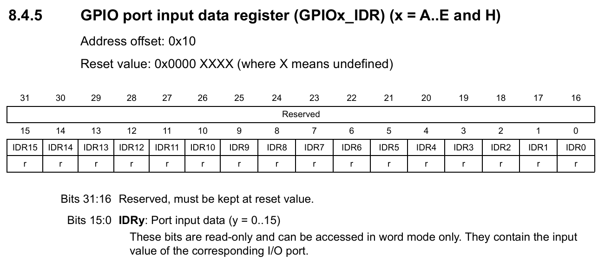

# LAB: GPIO Digital InOut

**Date:** 2025-09-17

**Author:** Yechan Kim

**Github:** https://github.com/YeChanKimm/EC-ycKim-153

**Demo Video:**  [Problem 2](https://youtu.be/Y8BV6x-TlCI?si=JpbLeojALsTE0GNd), [Problem 3](https://youtu.be/L4SP4v5GefQ?si=sajmZPY15o_JZLO4), [Problem 4](https://youtu.be/HiYflFn070Y?si=bYHIfz1736N8AOEP)

**PDF version:** 1.1


## Introduction

The goal of this lab is creating a program that toggles LEDs with a digital sensor(Photodetector) and push-button input. The lab consists of the following four tasks:

1. Create the library for GPIO Digital_In and Out
2. Toggle a single LED using a photodetector
3. Toggle a single LED using an input button
4. Toggle multiple LEDs using an input button


## Requirement

### Hardware

- MCU
  - NUCLEO-F411RE
- Eval Board


### Software

- PlatformIO, CMSIS, EC_HAL library


## Problem 1: Create EC_HAL

### Procedure

The goal of problem 1 is to modify the partially given header file so that it can be used for GPIO I/O.

You can download unmodified files through this link: [Given Files](https://github.com/ykkimhgu/EC-student/tree/main/include/lib-student)

Header files included the lab is as follows:

- `ecRCC2.h, ecRCC2.c`

  It initializes and configures the STM32F4 clock system (HSI, PLL, system clock) and enables peripheral clocks for GPIO ports A–E

  

- `ecPinNames.h, ecPinNames.c`

  This code defines pin names, port identifiers, and bitwise macros for STM32F411, and provides mappings between symbolic pin names (e.g., PA_0, D13) and actual GPIO registers.

  

- ` ecGPIO2.c, ecGPIO2.h`

  This code implements GPIO initialization and control functions for STM32F4 (pin mapping, mode, speed, output type, pull-up/pull-down, read, and write) using low-level register configuration.

These files are included in `repos\EC\include`


First of all, the PinName_t data type is a combined form of the port name and pin number. Therefore, within the function, it is necessary to map the port name and pin number given as parameters to the actual address, and for this reason, every function included in the corresponding header file contains code for this process. Code is as follows:

```c
GPIO_TypeDef * Port;
	unsigned int pin;
	ecPinmap(pinName, &Port, &pin);
```


#### ecRCC2.h, ecRCC2.c

In the case of `ecRCC2.h` and `ecRCC2.c`, only some of the GPIO ports among the whole ports were provided. 

To complete them, other ports were added to finalize the files. The following functions have been added:

* `void RCC_GPIOD_enable(void);`
* `void RCC_GPIOE_enable(void);`
* `void RCC_GPIOH_enable(void);`


Bellow is one of the added function (`void RCC_GPIOD_enable(void)`)

```c
void RCC_GPIOD_enable()
{
	// RCC Peripheral Clock Enable Register 
	RCC->AHB1ENR |= RCC_AHB1ENR_GPIODEN;
}
```

This function is a low-level RCC (Reset and Clock Control) routine that supplies a clock to GPIO Port D on STM32F4 devices by setting bit 3 (GPIODEN) in the AHB1 peripheral clock enable register (`RCC->AHB1ENR`) via a read-modify-write OR operation; enabling this gate is a prerequisite for any subsequent configuration or I/O on GPIOD (e.g., writes to `MODER`, `OTYPER`, `OSPEEDR`, `PUPDR`, `ODR`)


#### ecPinNames.h, ecPinNames.c

These files were provided in complete form, so no additional modifications were made. 

The file defines macros and enumerations to systematically handle the pins of the STM32F411 microcontroller, including bit-level register manipulation macros, as well as port names (`PortA`–`PortK`) and individual pin names (`PA_0`, `PB_3`, `PC_15`, etc.) assigned to consistent code values. It also maps Arduino-style pin naming (`A0`, `D13`, etc.) to make development more intuitive, and represents unconnected pins as `NC` to clearly indicate exceptions. Finally, it declares the prototype of the `ecPinmap` function, which converts a given pin name into its corresponding GPIO register address and pin number, enabling other source files to easily map pins at the hardware level.


#### ecGPIO2.h, ecGPIO2.c

This code provides a set of low-level GPIO functions for the STM32F4 microcontroller. It initializes a given pin by enabling the appropriate port clock and setting the pin mode (input, output, alternate function, or analog). It also includes functions to configure the pin’s speed, output type (push-pull or open-drain), and pull-up/pull-down resistors. 

To complete them, bellow functions has been modified:

* `void GPIO_init(PinName_t pinName, uint32_t mode);`
* `void GPIO_ospeed(PinName_t pinName, int speed);`
* `void GPIO_otype(PinName_t pinName, int type);`
* `void GPIO_pupd(PinName_t pinName, int pupd)`
* `int GPIO_read(PinName_t pinName)`
* `void GPIO_write(PinName_t pinName, int Output)`


1. **`void GPIO_init(PinName_t pinName, uint32_t mode);` **

As with `ecRCC.c`, the code to enable some of the ports was missing. So I added`RCC_GPIOB_enable();`, `RCC_GPIOD_enable();`, `RCC_GPIOE_enable();`, `RCC_GPIOH_enable();` , which is declared at `ecRCC2.h, ecRCC2.c`. 

Modified function is as follows:

```c
void GPIO_init(PinName_t pinName, uint32_t mode){     
	GPIO_TypeDef * Port;
	unsigned int pin;
	ecPinmap(pinName, &Port, &pin);
	
	// mode  : Input(0), Output(1), AlterFunc(2), Analog(3)   
	if (Port == GPIOA)
		RCC_GPIOA_enable();
	if (Port == GPIOC)
		RCC_GPIOC_enable();
	
	if (Port == GPIOB)
		RCC_GPIOB_enable();
	
	if (Port == GPIOD)
		RCC_GPIOD_enable();
	
	if (Port == GPIOE)
		RCC_GPIOE_enable();

	if (Port == GPIOH)
		RCC_GPIOH_enable();
	
	GPIO_mode(pinName, mode);
}
```


2. **`void GPIO_ospeed(PinName_t pinName, int speed);`** 

It controls output speed. Details of OSPEEDR register is as follows:


Initialize  2-bit parameter and then set the output speed(00, 01, 10, 11) . The completed function is as follows.

```c
// GPIO Speed  : Low speed (00), Medium speed (01), Fast speed (10), High speed(11)
void GPIO_ospeed(PinName_t pinName, int speed){

	GPIO_TypeDef * Port;
	unsigned int pin;
	ecPinmap(pinName,&Port,&pin);

	//Clear
	Port->OSPEEDR &=~(3UL<<(2*pin));
	
	//Write
	Port->OSPEEDR |=  (speed<<(pin*2));
	
}
```


3. **`void GPIO_otype(PinName_t pinName, int type)`**

It assigns output type. Details of OTYPER register is as follows:


Initialize  1-bit parameter and then set the output type(0, 1) . The completed function is as follows.

```c
// GPIO Output Type: Output push-pull (0, reset), Output open drain (1)
void GPIO_otype(PinName_t pinName, int type){
   	
	GPIO_TypeDef * Port;
	unsigned int pin;
	ecPinmap(pinName,&Port,&pin);

	//Clear
	Port->OTYPER &=~(1UL<<pin);

	//Write
	Port->OTYPER |= (type<<pin);

}
```


4. **`void GPIO_pupd(PinName_t pinName, int pupd)`**

This function is intended to prevent unstable signals that occur when the input value is left floating. By applying either pull-up or pull-down, the default value is stabilized to High or Low.

Details of PUPDR register is as follows:


Initialize  2-bit parameter and then set the Pull Up/ Pull Down(00, 01, 10, 11) . The completed function is as follows.

```c
// GPIO Push-Pull    : No pull-up, pull-down (00), Pull-up (01), Pull-down (10), Reserved (11)
void GPIO_pupd(PinName_t pinName, int pupd){
   
	GPIO_TypeDef * Port;
	unsigned int pin;
	ecPinmap(pinName,&Port,&pin);

	//Clear
	Port->PUPDR &=~(3UL<<(2*pin));

	//Write
	Port->PUPDR |=  (pupd<<(pin*2));
	
}
```


5. **`int GPIO_read(PinName_t pinName)`**

This function is intended to read the bit in the specific register using bitwise operation.

 Details of IDR register is as follows:




 The completed function is as follows:

```c
int GPIO_read(PinName_t pinName){

	GPIO_TypeDef *Port;
    unsigned int pin;
    ecPinmap(pinName, &Port, &pin);

	//read the bit
	return (Port->IDR >> pin) & (1);	

}
```


6. **`void GPIO_write(PinName_t pinName, int Output)`**

This function is intended to write the bit in the specific register using bitwise operation.

Details of ODR register is as follows:


 The completed function is as follows:

```c
void GPIO_write(PinName_t pinName, int Output){
	GPIO_TypeDef *Port;
    unsigned int pin;
    ecPinmap(pinName, &Port, &pin);

	//Clear
	Port->ODR &=~(1<<pin);

	//Write
	Port->ODR|=((Output&1)<<pin);


}
```


## Problem 2: Toggle a single LED with Digital Sensor(Photodetector)

### Procedure

The goal of the problem is to toggle a single LED(PB_12) with Photodetector(PA_4), which converts light into an electrical signal. 

First, hardware for the lab was made by connecting the given evaluation board to the MCU. Bellow is the the hardware used in the lab. 


The source code is saved in following repository:


Header files are saved in following repository:


New environment for problem 2 is as follows:


### Configuration

Configuration is as follows:

| Digital Sensor(Photodetector) | LED                               |
| ----------------------------- | --------------------------------- |
| Digital In                    | Digital Out                       |
| GPIOA, Pin 0                  | GPIOB, Pin 12                     |
| PULL-UP                       | Open-Drain, Pull-up, Medium Speed |


### Code

The entire code is in appendix. 

First, port ,pin addresses and configuration parameters  is declared as constants.

```c
//Header files used in the project
#include "ecRCC2.h"
#include "ecGPIO2.h"

//Address of the LED Used in the code
#define LED_PIN PB_12   

//Address of the Button Used in the code
#define BUTTON_PIN PA_0 

//Parameter numbers
#define PULL_DOWN 1
#define PULL_UP 2
#define PUSH_PULL 0
#define OPEN_DRAIN 1
#define LOW_SPEED 0
#define MEDIUM_SPEED 1
#define FAST_SPEED 2
#define HIGH_SPEED 3
```


Next, The setup function was written according to the given configuration.

```c
void setup(void) {
	
	// Initialize system clock to 16 MHz using the internal HSI oscillator
	RCC_HSI_init();
	
	// initialize the pushbutton pin as an input
	GPIO_init(BUTTON_PIN, INPUT);  

	// Configure th button with an internal pull-up resistor
	GPIO_pupd(BUTTON_PIN, PULL_UP);
	
	// initialize the LED pin as an output:
	GPIO_init(LED_PIN, OUTPUT);
	
	//Set output type as open drain
	GPIO_otype(LED_PIN, 0);

	// Configure the LED pin with an internal pull-up resistor
	GPIO_pupd(LED_PIN, PULL_DOWN);

	//Set the output speed as medium
	GPIO_ospeed(LED_PIN, MEDIUM_SPEED);

}
```


Then main function is written to turn on the LED according to given condition. 

```c
int main(void) { 
 	setup();
	int buttonState=0;
	
	while(1){
		//check if the pushbutton is pressed. Turn LED on/off accordingly:
		buttonState = GPIO_read(BUTTON_PIN);

		//If the light is blocked, the LED turns on; if the light enters, the LED turns off.
		if(buttonState)	GPIO_write(LED_PIN, LOW);
		else 		GPIO_write(LED_PIN, HIGH);
	

	}
}
```

### Result

|  |  |
| ----------------------------------------------------------- | ----------------------------------------------------------- |

Demo video link: [Problem 2](https://youtu.be/Y8BV6x-TlCI?si=JpbLeojALsTE0GNd)

### Discussion

1. **Find out a typical solution for software debouncing and hardware debouncing. **

   Software debouncing is a method that uses MCU code to handle unstable button signals. Common approach involves introducing a short delay after a button press is detected to allow the signal to stabilize before re-checking its state. This method has the advantage of not requiring additional hardware components, but it consumes MCU processing resources and can sacrifice some real-time performance. In contrast, hardware debouncing adds physical components to the circuit to directly eliminate button noise. RC filter circuit which consists of a resistor and a capacitor is a common example. It leverages the charging and discharging time of the capacitor to smooth out unstable voltage changes, delivering a stable signal to the MCU. This approach is more efficient as it doesn't burden the MCU but makes the circuit more complex and adds component costs. 

   

2. **What method of debouncing did this NUCLEO board use for the push-button(B1)?**

   The B1 button on the NUCLEO board is hardware-debounced through Schmitt trigger input processing and an RC filter at the circuit design stage. Therefore, the user can obtain stable button inputs without writing additional software debouncing code.


## Problem 3: Toggle a single LED with a Button

### Procedure

The goal of the problem is to toggle a single LED(PB_12) with a Button(PA_4), which converts light into an electrical signal. 

The source code is saved in following repository:


Header files are saved in following repository:


New environment for problem 3 is as follows:


### Configuration

Configuration is as follows:

| Digital Sensor(Photodetector) | LED                               |
| ----------------------------- | --------------------------------- |
| Digital In                    | Digital Out                       |
| GPIOA, Pin 0                  | GPIOB, Pin 12                     |
| PULL-UP                       | Open-Drain, Pull-up, Medium Speed |

### Code

The entire code is in appendix. 

First, port ,pin addresses and configuration parameters  is declared as constants, which is same with Problem 2. 

```c
//Parameter numbers
#define PULL_DOWN 1
#define PULL_UP 2
#define PUSH_PULL 0
#define OPEN_DRAIN 1
#define LOW_SPEED 0
#define MEDIUM_SPEED 1
#define FAST_SPEED 2
#define HIGH_SPEED 3
```


Next, The setup function was written according to the given configuration.

```c
// Initialiization 
void setup(void) {
	
	// Initialize system clock to 16 MHz using the internal HSI oscillator
	RCC_HSI_init();
	
	// initialize the pushbutton pin as an input
	GPIO_init(BUTTON_PIN, INPUT);  

	// Configure th button with an internal pull-up resistor
	GPIO_pupd(BUTTON_PIN, PULL_UP);
	
	// initialize the LED pin as an output:
	GPIO_init(LED_PIN, OUTPUT);
	
	//Set output type as push pull(open drain)
	GPIO_otype(LED_PIN, PUSH_PULL);

	// Configure the LED pin with an internal pull-up resistor
	GPIO_pupd(LED_PIN, PULL_DOWN);

	//Set the output speed as medium
	GPIO_ospeed(LED_PIN, MEDIUM_SPEED);

}
```


Following is the main function. 

After reading whether the button is pressed, turn off the LED if it is not pressed. Define the current and previous states of the button so that the LED operates only at the moment the button is pressed, and toggle the LED state.

```c
int main(void) { 
 	setup();

	//Declare the current and previous state of the button
	int buttonState=LOW;
	int prev_buttonState=HIGH;
	int led=HIGH;
	
	while(1){
		//check if the pushbutton is pressed. Turn LED on/off accordingly:
		buttonState = GPIO_read(BUTTON_PIN);

		
		//Set it so that the state changes only when the button is pressed.
		if(buttonState==LOW && prev_buttonState==HIGH)
		{
			//If the LED is on, turn it off; if it is off, turn it on.
			led=~(led);
			GPIO_write(LED_PIN, led);
			
		}

		//Store the current state of the button in the previous state variable.
		prev_buttonState=buttonState;
	}
}
```

### Result

|  |  |
| ----------------------------------------------------------- | ----------------------------------------------------------- |

Demo video link: [Problem 3](https://youtu.be/L4SP4v5GefQ?si=sajmZPY15o_JZLO4)

### Discussion

In this experiment, the designated button input was successfully linked to the corresponding register output, thereby demonstrating correct LED operation and fulfilling the intended objective. While the task involved relatively simple LED control, it provided a valuable opportunity to recognize the intrinsic relationship between hardware configuration and software implementation within embedded systems. The pull-up configuration of the button input effectively prevented floating states, thereby reducing unintended behavior. In addition, the use of the medium-speed output setting achieved a practical balance between minimizing power consumption and ensuring stable signal timing. Nonetheless, a limitation of the current design lies in the absence of software-based debouncing, which may lead to signal instability under rapid button actuation. Future work may address this limitation by integrating a debouncing algorithm or other enhancement techniques to improve reliability.


## Problem 4: Toggle multiple LEDs with a button

### Procedure

The goal of the problem is to toggle multiple LED(PB12, PB13, PB14, PB15) with a Button(PA_4), which converts light into an electrical signal. 

The source code is saved in following repository:


Header files are saved in following repository:


New environment for problem 3 is as follows:


### Configuration 

| Digital Sensor(Photodetector) | LED                                   |
| ----------------------------- | ------------------------------------- |
| Digital In                    | Digital Out                           |
| GPIOA, Pin 0                  | GPIOB, Pin 12, Pin 13, Pin 14, Pin 15 |
| PULL-UP                       | Push-Pull, Pull-up, Medium Speed      |


### Circuit Diagram

The circuit diagram for problem 4 is as follow:


### Code

As in the previous problem, constant values were declared; however, in this case, since four LEDs were used, their address values were declared in an array to facilitate easier control, thereby distinguishing this implementation from the previous one.

```c
PinName_t LED[4] = {
    PB_12,PB_13,PB_14,PB_15
};

//Address of the Button Used in the code
#define BUTTON_PIN PA_4 


//Parameter numbers
#define PULL_DOWN 1
#define PULL_UP 2
#define PUSH_PULL 0
#define OPEN_DRAIN 1
#define LOW_SPEED 0
#define MEDIUM_SPEED 1
#define FAST_SPEED 2
#define HIGH_SPEED 3
```


Similarly, the setup was configured in a manner comparable to the previous problem; however, a loop was employed in this case to handle the four LEDs simultaneously.

```c
void setup(void)
{   
    
    // Initialize system clock to 16 MHz using the internal HSI oscillator
    RCC_HSI_init();

    // initialize the pushbutton pin as an input
    GPIO_init(BUTTON_PIN, INPUT);

    // Configure th button with an internal pull-up resistor
	GPIO_pupd(BUTTON_PIN, PULL_UP);

    // initialize LED pins as an output:
    for (int i=0; i<4; ++i) GPIO_init(LED[i], OUTPUT);

    //Set output type as push pull(open drain)
    for (int i=0; i<4; ++i) GPIO_otype(LED[i], PUSH_PULL);

    // Configure LED pins with an internal pull-up resistor
    for (int i=0; i<4; ++i) GPIO_pupd(LED[i], PULL_UP);

    //Set the output speed as medium
    for (int i=0; i<4; ++i) GPIO_ospeed(LED[i], MEDIUM_SPEED);

}
```


Similar to the previous problem, an algorithm was written by declaring both the previous and current states of the button to detect the pressing edge. However, in this case, a variable for the current LED index was declared so that the four LEDs could be turned on sequentially.

```c
int main(void)
{
    //Set the register
    setup();

    //Declare the current and previous state of the button
    int buttonState=LOW;
    int Last_buttonState=LOW;

    //Initialize the current LED
    int crtLED=0;
 
    while(1)
    {
        //check if the pushbutton is pressed. Turn LED on/off accordingly:
        buttonState=GPIO_read(BUTTON_PIN);

        //Set it so that the state changes only when the button is pressed.
        if((buttonState==LOW && Last_buttonState==HIGH) )
        {
            //Turn off all of LED
            for(int i=0; i<4; ++i) GPIO_write(LED[i],LOW);
           
            //Turn on current LED
            GPIO_write(LED[crtLED],HIGH);

            //Set the next LED as the current one
            crtLED=(crtLED+1)%4;
            
        }

        //Store the current state of the button in the previous state variable.
        Last_buttonState=buttonState; 
    } 
}
```


### Results

The results of problem 4 are as follows:

|  |  |
| ------------------------------------------------------------ | ------------------------------------------------------------ |
|  |  |

Demo video link: [Problem 4](https://youtu.be/HiYflFn070Y?si=bYHIfz1736N8AOEP)


### Discussion

In accordance with the objective of the experiment, the LEDs were successfully turned on sequentially in response to button inputs, and the sequence was implemented such that after the fourth LED was lit, the process returned to the first LED. In particular, by comparing the current and previous states of the button, edge detection was achieved, allowing the input to be processed more reliably. This experiment also demonstrated how multiple outputs can be controlled through a single input, while arrays and loops were utilized to enhance code reusability and scalability. However, as in the previous problem, the absence of a debouncing algorithm presented a limitation, as unintended LED activations could occur under rapid button inputs. To address this limitation, incorporating a debouncing algorithm would further strengthen the robustness of the system.


## Appendix

**ecRCC.h **

```c
#ifndef __EC_RCC2_H
#define __EC_RCC2_H

#ifdef __cplusplus
 extern "C" {
#endif /* __cplusplus */

//#include "stm32f411xe.h"

void RCC_HSI_init(void);
void RCC_PLL_init(void);
void RCC_GPIOA_enable(void);
void RCC_GPIOB_enable(void);
void RCC_GPIOC_enable(void);
void RCC_GPIOD_enable(void);
void RCC_GPIOE_enable(void);
void RCC_GPIOH_enable(void);

extern int EC_SYSCL;

#ifdef __cplusplus
}
#endif /* __cplusplus */

#endif // __EC_RCC2_H
```


**ecRCC.c ** 

```c
#include "stm32f4xx.h"
#include "ecRCC2.h"

volatile int EC_SYSCLK=16000000;

void RCC_HSI_init() {
	// Enable High Speed Internal Clock (HSI = 16 MHz)
  //RCC->CR |= ((uint32_t)RCC_CR_HSION);
	RCC->CR |= 0x00000001U;
	
  // wait until HSI is ready
  //while ( (RCC->CR & (uint32_t) RCC_CR_HSIRDY) == 0 ) {;}
	while ( (RCC->CR & 0x00000002U) == 0 ) {;}
	
  // Select HSI as system clock source 
  RCC->CFGR &= (uint32_t)(~RCC_CFGR_SW); 								// not essential
  RCC->CFGR |= (uint32_t)RCC_CFGR_SW_HSI; 								//00: HSI16 oscillator used as system clock

	// Wait till HSI is used as system clock source
  while ((RCC->CFGR & (uint32_t)RCC_CFGR_SWS) != 0 );
		   
	//EC_SYSTEM_CLK=16000000;
		//EC_SYSCLK=16000000;
		EC_SYSCLK=16000000;
}

void RCC_PLL_init() {	
	// To correctly read data from FLASH memory, the number of wait states (LATENCY)
  // must be correctly programmed according to the frequency of the CPU clock
  // (HCLK) and the supply voltage of the device.		
	FLASH->ACR &= ~FLASH_ACR_LATENCY;
	FLASH->ACR |=  FLASH_ACR_LATENCY_2WS;
		
	// Enable the Internal High Speed oscillator (HSI)
	RCC->CR |= RCC_CR_HSION;
	while((RCC->CR & RCC_CR_HSIRDY) == 0);
	
	// Disable PLL for configuration
	RCC->CR    &= ~RCC_CR_PLLON;
	
	// Select clock source to PLL
	RCC->PLLCFGR &= ~RCC_PLLCFGR_PLLSRC; 		// Set source for PLL: clear bits
	RCC->PLLCFGR |= RCC_PLLCFGR_PLLSRC_HSI; // Set source for PLL: 0 =HSI, 1 = HSE
	
	// Make PLL as 84 MHz
	// f(VCO clock) = f(PLL clock input) * (PLLN / PLLM) = 16MHz * 84/8 = 168 MHz
	// f(PLL_R) = f(VCO clock) / PLLP = 168MHz/2 = 84MHz
	RCC->PLLCFGR = (RCC->PLLCFGR & ~RCC_PLLCFGR_PLLN) | 84U << 6;
	RCC->PLLCFGR = (RCC->PLLCFGR & ~RCC_PLLCFGR_PLLM) | 8U ; 
	RCC->PLLCFGR &= ~RCC_PLLCFGR_PLLP;  // 00: PLLP = 2, 01: PLLP = 4, 10: PLLP = 6, 11: PLLP = 8	
	
	
	// Enable PLL after configuration
	RCC->CR   |= RCC_CR_PLLON; 
	while((RCC->CR & RCC_CR_PLLRDY)>>25 != 0);
	
	// Select PLL as system clock
	RCC->CFGR &= ~RCC_CFGR_SW;
	RCC->CFGR |= RCC_CFGR_SW_PLL;
	
	// Wait until System Clock has been selected
	while ((RCC->CFGR & RCC_CFGR_SWS) != 8UL);
	
	// The maximum frequency of the AHB and APB2 is 100MHz,
	// The maximum frequency of the APB1 is 50 MHz.
	RCC->CFGR &= ~RCC_CFGR_HPRE;  		// AHB prescaler = 1; SYSCLK not divided (84MHz)
	RCC->CFGR &= ~RCC_CFGR_PPRE1; 		// APB high-speed prescaler (APB1) = 2, HCLK divided by 2 (42MHz)
	RCC->CFGR |=  RCC_CFGR_PPRE1_2;
	RCC->CFGR &= ~RCC_CFGR_PPRE2; 		// APB high-speed prescaler (APB2) = 1, HCLK not divided	(84MHz)
	
	EC_SYSCLK=84000000;
}


void RCC_GPIOA_enable()
{
	// RCC Peripheral Clock Enable Register 
	RCC->AHB1ENR |= RCC_AHB1ENR_GPIOAEN;
}

void RCC_GPIOB_enable()
{
	// RCC Peripheral Clock Enable Register 
	RCC->AHB1ENR |= RCC_AHB1ENR_GPIOBEN;
}

void RCC_GPIOC_enable()
{
	// RCC Peripheral Clock Enable Register 
	RCC->AHB1ENR |= RCC_AHB1ENR_GPIOCEN;
}
```


**ecPinNames.h ** 

```c
#ifndef EC_PINNAMES_H
#define EC_PINNAMES_H

#include "stm32f411xe.h"

#ifdef __cplusplus
extern "C" {
#endif


// Bitwise Macro Definition
#define BIT_SET(REG, BIT)      	((REG) |= 1<< (BIT))
#define BIT_CLEAR(REG, BIT)     ((REG) &= ~1<<(BIT))
#define BIT_READ(REG, BIT)      ((REG)>>BIT & (1))
#define BITS_SET(REG, BIT,NUM)     ((REG) |= NUM<< (BIT))
#define BITS_CLEAR(REG, BIT,NUM)   ((REG) &= ~(NUM<< (BIT))
//#define BITS_CLEAR(REG, BIT,NUM)   ((REG) &= ~((0x1<< NUM)-1)<<(BIT))


// Pinname Config
typedef enum {
    PortA = 0,
    PortB = 1,
    PortC = 2,
    PortD = 3,
    PortE = 4,
    PortF = 5,
    PortG = 6,
    PortH = 7,
    PortI = 8,
    PortJ = 9,
    PortK = 10
} PortName_t;


typedef enum {
    PA_0  = 0x00,
    PA_1  = 0x01,    
    PA_2  = 0x02,
    PA_3  = 0x03,
    PA_4  = 0x04,    
    PA_5  = 0x05,
    PA_6  = 0x06,
    PA_7  = 0x07,
    PA_8  = 0x08,
    PA_9  = 0x09,
    PA_10 = 0x0A,
    PA_11 = 0x0B,
    PA_12 = 0x0C,
    PA_13 = 0x0D,
    PA_14 = 0x0E,
    PA_15 = 0x0F,
    
    PB_0  = 0x10,
    PB_1  = 0x11,
    PB_2  = 0x12,
    PB_3  = 0x13,
    PB_4  = 0x14,
    PB_5  = 0x15,
    PB_6  = 0x16,
    PB_7  = 0x17,
    PB_8  = 0x18,
    PB_9  = 0x19,
    PB_10 = 0x1A,
    PB_12 = 0x1C,
    PB_13 = 0x1D,
    PB_14 = 0x1E,
    PB_15 = 0x1F,

    PC_0  = 0x20,
    PC_1  = 0x21,
    PC_2  = 0x22,
    PC_3  = 0x23,
    PC_4  = 0x24,
    PC_5  = 0x25,
    PC_6  = 0x26,
    PC_7  = 0x27,
    PC_8  = 0x28,
    PC_9  = 0x29,
    PC_10 = 0x2A,
    PC_11 = 0x2B,
    PC_12 = 0x2C,
    PC_13 = 0x2D,
    PC_14 = 0x2E,
    PC_15 = 0x2F,

    PD_2  = 0x32,

    PH_0  = 0x70,
    PH_1  = 0x71,


    // Arduino connector namings
    A0          = PA_0,
    A1          = PA_1,
    A2          = PA_4,
    A3          = PB_0,
    A4          = PC_1,
    A5          = PC_0,
    D0          = PA_3,
    D1          = PA_2,
    D2          = PA_10,
    D3          = PB_3,
    D4          = PB_5,
    D5          = PB_4,
    D6          = PB_10,
    D7          = PA_8,
    D8          = PA_9,
    D9          = PC_7,
    D10         = PB_6,
    D11         = PA_7,
    D12         = PA_6,
    D13         = PA_5,
    D14         = PB_9,
    D15         = PB_8,


    // Not connected
    NC = (int)0xFFFFFFFF
} PinName_t;


void ecPinmap(PinName_t pinName, GPIO_TypeDef **GPIOx, unsigned int *pin);


#ifdef __cplusplus
}
#endif

#endif
```


**ecPinNames.c ** 

```c
#include "ecPinNames.h"

void ecPinmap(PinName_t pinName, GPIO_TypeDef **GPIOx, unsigned int *pin)
{
	
	unsigned int pinNum= pinName & (0x000F);
	*pin=pinNum;

	unsigned int portNum=(pinName>>4);
	
	
	if (portNum==0)
		*GPIOx=GPIOA;
	else if (portNum==1)
		*GPIOx=GPIOB;
	else if (portNum==2)
		*GPIOx=GPIOC;
	else if (portNum==3)
		*GPIOx=GPIOD;
	else if (portNum==7)
		*GPIOx=GPIOH;
	else 
		*GPIOx=GPIOA;
}
```


**LAB_GPIO_DIO_photosensor.c**

```c
/*----------------------------------------------------------------\
@ Embedded Controller by Yechan Kim - Handong Global University
Author           : Yechan Kim
Student Number	 : 22100153
Created          : 09-17-2025
/----------------------------------------------------------------*/

//Header files used in the project
#include "ecRCC2.h"
#include "ecGPIO2.h"
#include "ecPinNames.h"

//Address of the LED Used in the code
#define LED_PIN PB_12   

//Address of the Button Used in the code
#define BUTTON_PIN PA_0 

//Parameter numbers
#define PULL_DOWN 1
#define PULL_UP 2
#define PUSH_PULL 0
#define OPEN_DRAIN 1
#define LOW_SPEED 0
#define MEDIUM_SPEED 1
#define FAST_SPEED 2
#define HIGH_SPEED 3


// Initialiization 
void setup(void) {
	
	// Initialize system clock to 16 MHz using the internal HSI oscillator
	RCC_HSI_init();
	
	// initialize the pushbutton pin as an input
	GPIO_init(BUTTON_PIN, INPUT);  

	// Configure th button with an internal pull-up resistor
	GPIO_pupd(BUTTON_PIN, PULL_UP);
	
	// initialize the LED pin as an output:
	GPIO_init(LED_PIN, OUTPUT);
	
	//Set output type as push pull(open drain)
	GPIO_otype(LED_PIN, PUSH_PULL);

	// Configure the LED pin with an internal pull-up resistor
	GPIO_pupd(LED_PIN, PULL_DOWN);

	//Set the output speed as medium
	GPIO_ospeed(LED_PIN, MEDIUM_SPEED);

}
	
int main(void) { 
 	setup();

	//Declare the current and previous state of the button
	int buttonState=0;
	int prev_buttonState=0;
	
	
	while(1){
		//check if the pushbutton is pressed. Turn LED on/off accordingly:
		buttonState = GPIO_read(BUTTON_PIN);

		//If the button is not pressed, turn off the LED.
		if(buttonState)	GPIO_write(LED_PIN, LOW);
		
		//Set it so that the state changes only when the button is pressed.
		if(buttonState==LOW && prev_buttonState==HIGH)
		{
			//If the LED is on, turn it off; if it is off, turn it on.
			buttonState=~(buttonState);
			GPIO_write(LED_PIN, buttonState);
		}

		//Store the current state of the button in the previous state variable.
		prev_buttonState=buttonState;
	}
}
```


**LAB_GPIO_DIO_LED_Button.c**

```c
/*----------------------------------------------------------------\
@ Embedded Controller by Yechan Kim - Handong Global University
Author           : Yechan Kim
Student Number	 : 22100153
Created          : 09-17-2025
/----------------------------------------------------------------*/

//Header files used in the project
#include "ecRCC2.h"
#include "ecGPIO2.h"
#include "ecPinNames.h"

//Address of the LED Used in the code
#define LED_PIN PB_12   

//Address of the Button Used in the code
#define BUTTON_PIN PA_4 

//Parameter numbers
#define PULL_DOWN 1
#define PULL_UP 2
#define PUSH_PULL 0
#define OPEN_DRAIN 1
#define LOW_SPEED 0
#define MEDIUM_SPEED 1
#define FAST_SPEED 2
#define HIGH_SPEED 3

// Initialiization 
void setup(void) {
	// Initialize system clock to 16 MHz using the internal HSI oscillator
	RCC_HSI_init();
	
	// initialize the pushbutton pin as an input
	GPIO_init(BUTTON_PIN, INPUT);  

	// Configure th button with an internal pull-up resistor
	GPIO_pupd(BUTTON_PIN, PULL_UP);
	
	// initialize the LED pin as an output:
	GPIO_init(LED_PIN, OUTPUT);
	
	//Set output type as push pull(open drain)
	GPIO_otype(LED_PIN, PUSH_PULL);

	// Configure the LED pin with an internal pull-up resistor
	GPIO_pupd(LED_PIN, PULL_DOWN);

	//Set the output speed as medium
	GPIO_ospeed(LED_PIN, MEDIUM_SPEED);
}
	

int main(void) { 

	//Set the register
 	setup();

	//Declare the current and previous state of the button
	int buttonState=LOW;
	int prev_buttonState=HIGH;

	//Declare led state for toggling
	int ledState=LOW;
	
	while(1){
		//check if the pushbutton is pressed. Turn LED on/off accordingly:
		buttonState = GPIO_read(BUTTON_PIN);

		
		//Set it so that the state changes only when the button is pressed.
		if(buttonState==LOW && prev_buttonState==HIGH)
		{
			//If the LED is on, turn it off; if it is off, turn it on.
			ledState=~(ledState);
			GPIO_write(LED_PIN, ledState);
			
		}

		//Store the current state of the button in the previous state variable.
		prev_buttonState=buttonState;
	}
}


```


**LAB_GPIO_DIO_multiLED.c**

```c
/*----------------------------------------------------------------\
@ Embedded Controller by Yechan Kim - Handong Global University
Author           : Yechan Kim
Student Number	 : 22100153
Created          : 09-17-2025
/----------------------------------------------------------------*/

//Header files used in the project
#include "ecRCC2.h"
#include "ecGPIO2.h"
#include "ecPinNames.h"

//Addresses of LEDs Used in the code
PinName_t LED[4] = {
    PB_12,PB_13,PB_14,PB_15
};

//Address of the Button Used in the code
#define BUTTON_PIN PA_4 


//Parameter numbers
#define PULL_DOWN 1
#define PULL_UP 2
#define PUSH_PULL 0
#define OPEN_DRAIN 1
#define LOW_SPEED 0
#define MEDIUM_SPEED 1
#define FAST_SPEED 2
#define HIGH_SPEED 3


void setup(void)
{   
    
    // Initialize system clock to 16 MHz using the internal HSI oscillator
    RCC_HSI_init();

    // initialize the pushbutton pin as an input
    GPIO_init(BUTTON_PIN, INPUT);

    // Configure th button with an internal pull-up resistor
	GPIO_pupd(BUTTON_PIN, PULL_UP);

    // initialize LED pins as an output:
    for (int i=0; i<4; ++i) GPIO_init(LED[i], OUTPUT);

    //Set output type as push pull(open drain)
    for (int i=0; i<4; ++i) GPIO_otype(LED[i], PUSH_PULL);

    // Configure LED pins with an internal pull-up resistor
    for (int i=0; i<4; ++i) GPIO_pupd(LED[i], PULL_UP);

    //Set the output speed as medium
    for (int i=0; i<4; ++i) GPIO_ospeed(LED[i], MEDIUM_SPEED);

}
	

int main(void)
{
    //Set the register
    setup();

    //Declare the current and previous state of the button
    int buttonState=LOW;
    int Last_buttonState=LOW;

    //Initialize the current LED
    int crtLED=0;
 
    while(1)
    {
        //check if the pushbutton is pressed. Turn LED on/off accordingly:
        buttonState=GPIO_read(BUTTON_PIN);

        //Set it so that the state changes only when the button is pressed.
        if((buttonState==LOW && Last_buttonState==HIGH) )
        {
            //Turn off all of LED
            for(int i=0; i<4; ++i) GPIO_write(LED[i],LOW);
           
            //Turn on current LED
            GPIO_write(LED[crtLED],HIGH);

            //Set the next LED as the current one
            crtLED=(crtLED+1)%4;
            
        }

        //Store the current state of the button in the previous state variable.
        Last_buttonState=buttonState; 
    } 
}
```

