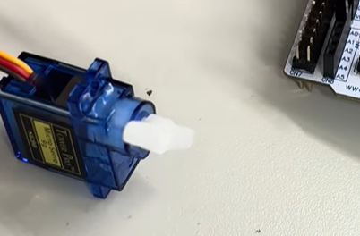
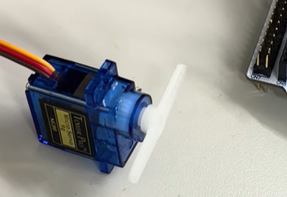
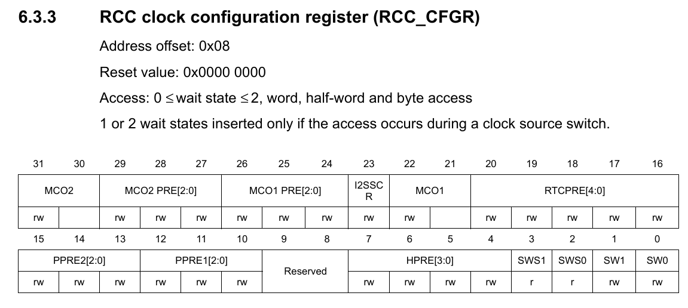
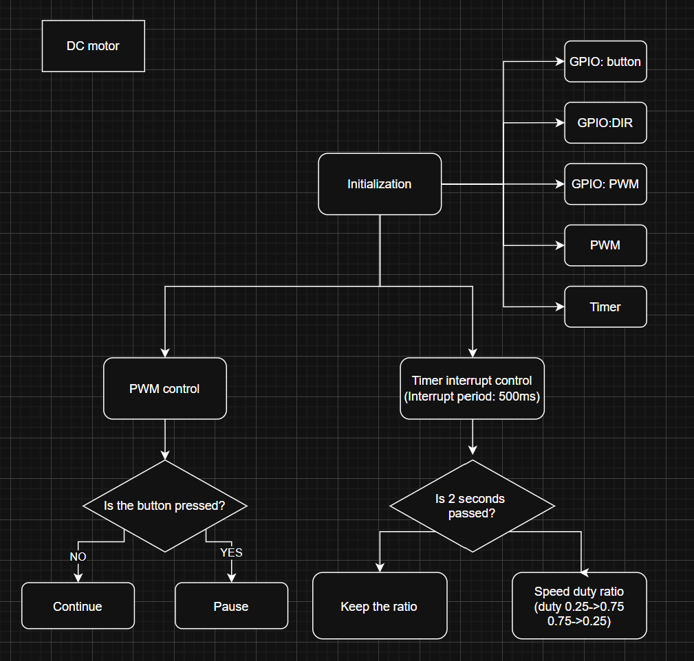

# LAB: PWM

**Date:** 2025-10-22

**Author:** Yechan Kim

**Github:** https://github.com/YeChanKimm/EC-ycKim-153

**Demo Video:** https://youtube.com/shorts/f7NNSKGHxVA?si=V68y1VH4_x-96YjP

**PDF version:** 1.1

## Introduction

In this lab, the goal is to control DC and RC servo motor using PWM pulse. 

The flowchart for the overall lab is as follows:


### Requirement

**Hardware**

- MCU
  
  -NUCLEO-F411RE

- Actuator/Sensor/Others:
  
  -RC Servo Motor (SG90)
  
  -DC motor (5V)
  
  -DC motor driver(LS9110s or L298N)

**Software**

- PlatformIO, CMSIS, EC_HAL library

### Documentation

You can download header files used in this lab [here](https://github.com/YeChanKimm/EC-ycKim-153/tree/main/include)

Bellow files are included:

#### `ecTIME2.h`

It implements GPIO initialization and control functions (mode, speed, type, pull-up/down, read, write) for STM32F4 using pin-to-port mapping

#### `ecPWM2.h`

It combines the port name and pin number into a single variable and maps it to the actual register address.

You can see the detail of these headers in my documentation [here](https://github.com/YeChanKimm/EC-ycKim-153/blob/main/README.md)

## Problem 1: RC servo motor

In this problem, the goal is to control RC servo motor using PWM pulse width. The angle of the motor can be controlled by the pulse width (duty ratio) of PWM signal.

Bellow is the flowchart of the problem:


Bellow is the basic information of the motor:


The RC servo motor stay 0° when pulse width is 0.5ms, move to 90° when 1.5ms, and move to 180° when 2.5ms.

### Configuration

The configuration of the problem is as follows:

| Type            | Port-Pin         | Configuration                                      |
| --------------- | ---------------- | -------------------------------------------------- |
| Button          | Digital In(PC13) | Pull-Up                                            |
| PWM Pin         | AF (PA1)         | Push-Pull, Pull-Up, Fast                           |
| PWM Timer       | TIM2_CH2 (PA1)   | TIM2 (PWM) period: 20msec, Duty ratio: 0.5~2.5msec |
| Timer Interrupt | TIM3             | TIM3: Timer Interrupt of 500 msec                  |

### Procedure

The environment for problem 1 is constructed as follows:


#### ``Header file``

First, the only header file included in the code is `ecSTM32F4v2.h`.  

```c
#include "ecSTM32F4v2.h"
```

This file contains the declarations of the header files required for the project, and the list of those header files is as follows.

- `ecPinNames.h`
- `ecRCC2.h`
- `ecGPIO2.h`
- `ecEXTI2.h`
- `ecSysTick2.h`
- `ecTIM2.h`
- `ecPWM2.h`

You can see the details of `ecSTM32F4v2.h` [here](https://github.com/YeChanKimm/EC-ycKim-153/blob/main/include/ecSTM32F4v2.h) or Appendix of this report. 

#### `setup()`

A comprehensive register initialization function was built using the previously defined functions. In `setup()`, GPIO: Button pin and PWM pin is initialized as following the configiration, and PWM and Timer interrupt period is set as well. 

For the interrupt priorities, `EXTI` was has the highest priority, and `Timer`  has priority of 2. 

```c
void setup(void) {    

    //PLL initialize
    RCC_PLL_init();

    // Button Pin initialize
    GPIO_init(BUTTON_PIN, INPUT);
    GPIO_pupd(BUTTON_PIN, PULL_UP);
    EXTI_init(BUTTON_PIN, FALL, 0);


    //PWM Pin initialize
    PWM_init(PWM_PIN);
    PWM_period_us(PWM_PIN,20000);
    GPIO_otype(PWM_PIN, PUSH_PULL);
    GPIO_pupd(PWM_PIN, PULL_UP);
    GPIO_ospeed(PWM_PIN,FAST_SPEED);

    //Timer Interupt initialize
    TIM_UI_init(TIM3,500);
    TIM_UI_enable(TIM3);
}
```

Compared to the previous library, bellow functions were additionally defined and used:

- `PWM_init()`

- `PWM_period_us()`

- `TIM_UI_init()`

- `TIM_UI_enable()`

You can see the detail above functions in my library [here](https://github.com/YeChanKimm/EC-ycKim-153/tree/main)

#### `main()`

In this problem, the motor was controlled solely using interrupts, so only the `setup()` function was executed in the main loop.

```c
int main(void) {
    // Initialization --------------------------------------------------
    setup();    

    // Infinite Loop ---------------------------------------------------
    while(1){ }
}
```

#### `EXTI15_10_IRQHandler()`

Since `PC13` was used as the button pin, the `EXTI15_10_IRQHandler()` was used as the EXTI ISR. This interrupt service routine had the highest priority and, when the button was pressed, it reset both the pulse width and the current state.

```c
void EXTI15_10_IRQHandler(void)
{
    if(is_pending_EXTI(BUTTON_PIN))
    {
        //Initial state of pulse width and current state
        pulse_width=500;
        currentState=0;

        //Pending clear
        clear_pending_EXTI(BUTTON_PIN);
    }
}
```

#### `TIM3_IRQHandler()`

This ISR (`TIM3_IRQHandler`) updates the motor’s position every timer interrupt by adjusting the PWM pulse width ±110 µs, alternating the motor’s direction every 180°, and then clearing the update interrupt flag.

```c
void TIM3_IRQHandler(void)
{

    if(is_UIF(TIM3)){

        //Update current state
        currentState++;

        //If the angle of the motor is lower than 180°, move 20°(pulse width 110 us)
        if((currentState/19)%2==0)                                 
        {
            unit_move=110;
        }

        //If the angle of the motor is higher than 180°, move -20°(pulse width -110 us) and go to the first place
        else if((currentState/19)%2==1)
        {
            unit_move=-110;

        }

        //Update the pulse width
        pulse_width+=unit_move;
        PWM_pulsewidth_us(PWM_PIN, pulse_width);


        clear_UIF(TIM3);
    }
}
```

For PWM and Timer functions, you can see the detail [here](https://github.com/YeChanKimm/EC-ycKim-153/blob/main/README.md)

### Results

Bellow is the results. There are 18 states which are from 0°~180° and You can see the full results(e.g. pressing button, going back to the first state) in the demo video.

| state 1                | state 2                | state 3                | state 4                | state 5                | state 6                |
| ---------------------- | ---------------------- | ---------------------- | ---------------------- | ---------------------- | ---------------------- |
|   |   |   |   |   |   |
| state 7                | state 8                | state 9                | state 10               | state 11               | state 12               |
|   |   |   |  |  |  |
| state 13               | state 14               | state 15               | state 16               | state 17               | state 18               |
|  |  |  |  |  |  |

You can see the demo video [here](https://youtube.com/shorts/o6ZyQRuhiek?si=PIcV_axvzfe-kHz5)

### Discussion

1. **Derive a simple logic to calculate CRR and ARR values to generate x[Hz] and y[%] duty ratio of PWM. How can you read the values of input clock frequency and PSC?**
   
   Bellow is the flow of creating timer signal. 
   
   
   
   In general, the source frequency is 84MHz from PLL, and it is too fast to control. So to prescale the source frequency, bellow formular is applied:
   
   $$
   fcnt=\frac{fpsc}{PSC+1}
   $$
   
   And by setting ARR value in up/down counter, counter period is produced. The process is as bellow: 
   
   $$
   fpwm=\frac{fcnt}{1+ARR}
   $$
   
   So `ARR` value can be determined:
   
   $$
   ARR=\frac{fcnt}{fpwm}-1
   $$
   
   And if it is mode1, duty ratio is determined as following:
   
   $$
   Duty=\frac{CRR}{ARR+1}
   $$
   
   So `CRR` value can be determined:
   
   $$
   CRR=Duty\times (ARR+1)
   $$

   And we can read input clock frequency by reading `RCC_CFGR` register:

   

   

   `SW` give us the information of source clock, and if it is PLL, we can know it's value of `84MHz`with `RCC` library:

   

   And for `PSC` value, we can determine it by reading `TIMx_PSC` register. 

   

2. **What is the smallest and highest PWM frequency that can be generated for Q1?**
   
   PWM frequency is determined by `ARR` and `PSC` values. Suppose that it is `TIM2`(32bit) and `PLL`source(84MHz)
   
   **Minimum**
   
   $$
   ARR=1, PSC=0
   $$
   
   $$
   fmax=\frac{84,000,000}{1+1}=42MHz

   $$

          **Minimum**

$$
ARR=4,294,967,295, PSC = 4,294,967,295
$$

$$
fmin=\frac{8400}{4,294,967,295}=4.55\times 10^{-12}
$$

## 


## Problem 2: DC motor

In this problem, the goal was to adjust the duty ratio to change the DC motor speed every two seconds. When the button is pressed, the entire system stops, and pressing the button again resumes normal operation. During this process, both the Timer interrupt and the EXTI interrupt were used.

Bellow is the flowchart of the problem:




### Configuration

Bellow is the configuration of the problem:

| Function        | Port-Pin          | Configuration                     |
| --------------- | ----------------- | --------------------------------- |
| Button          | Digital In (PC13) | Pull-Up                           |
| Direction Pin   | Digital Out (PC2) | Push-Pull                         |
| PWM Pin         | AF (PA0)          | Push-Pull, Pull-Up, Fast          |
| PWM Timer       | TIM2_CH1 (PA0)    | TIM2 (PWM) period: 1msec (1kHz)   |
| Timer Interrupt | TIM3              | TIM3: Timer Interrupt of 500 msec |


### Procedure

The environment for problem 1 is constructed as follows:


#### `Header file`

First, the only header file included in the code is `ecSTM32F4v2.h`.

```c
#include "ecSTM32F4v2.h"
```

This file contains the declarations of the header files required for the project, and the list of those header files is as follows.

- `ecPinNames.h`
- `ecRCC2.h`
- `ecGPIO2.h`
- `ecEXTI2.h`
- `ecSysTick2.h`
- `ecTIM2.h`
- `ecPWM2.h`

You can see the details of `ecSTM32F4v2.h` [here](https://github.com/YeChanKimm/EC-ycKim-153/blob/main/include/ecSTM32F4v2.h) or Appendix of this report.

#### `setup()`

The `setup(void)` function initializes the DC motor control system by setting up the system clock, button input with interrupt, direction output pin, and PWM for speed control. It also configures Timer 3 to generate an interrupt every 0.5 seconds for periodic motor speed updates.

EXTI has the highest priority, and  Timer 3 Interrupt has lower one. 

```c
void setup(void) {	
	
    //PLL initialize
    RCC_PLL_init();
	
    // Button Pin initialize
	GPIO_init(BUTTON_PIN, INPUT);
    GPIO_pupd(BUTTON_PIN, PULL_UP);
    EXTI_init(BUTTON_PIN, FALL, 0);


    //Direction Pin initialize
    GPIO_init(DIRECTION_PIN, OUTPUT);
    GPIO_otype(DIRECTION_PIN, PUSH_PULL);
  

    //PWM PIN initialize
	PWM_init(PWM_PIN);
    PWM_period_ms(PWM_PIN,1);
    GPIO_otype(PWM_PIN, PUSH_PULL);
    GPIO_pupd(PWM_PIN, PULL_UP);
    GPIO_ospeed(PWM_PIN,FAST_SPEED);
    

	//Timer3 interupt  0.5s
    TIM_UI_init(TIM3,500);
    
}
```


#### `EXTI15_10_IRQHandler()`

Through this interrupt, the motor stops or resumes when the button is pressed. Because the user button is `PB_13`, `EXTI15_10_IRQHandler()` was used as the ISR. 

```c

int motorState=0;

void EXTI15_10_IRQHandler(void)
{
    if(is_pending_EXTI(BUTTON_PIN))
    {   
        //Toggle the motor state to pause or release the motor
        motorState=!motorState;
    }

    clear_pending_EXTI(BUTTON_PIN);
}
```


#### `TIM3_IRQHandler()`

In this interrupt, the time is updated every 0.5 seconds, and if 2 seconds have passed, the duty ratio is changed to adjust the motor speed.

```c
void TIM3_IRQHandler(void)
{
    if((is_UIF(TIM3)) == HIGH){
       
       //Update the time state
        timerState++;

        //If 2seconds passed, change the duty ratio
       if(timerState%4==0) 
       {
            //Slow->Fast
            if(targetPWM==0.25) targetPWM = 0.75;

            //Fast->Slow
            else if(targetPWM==0.75) targetPWM = 0.25;
       }
       clear_UIF(TIM3);
    }
}
```


#### `main() & motor_on_off()`

A function `motor_on_off()` was defined in the main loop to control the motor’s operation, stopping or resuming it based on the motor state set by the EXTI interrupt.

```c
void motor_on_off(void)
{
    //If the button is pressed and the motor was paused, release it. 
    if(motorState==0) PWM_duty(PWM_PIN,targetPWM);

    //If the button is pressed and the motor was released, pause it.  
    else if(motorState==1) PWM_duty(PWM_PIN,0.0);

}

int main(void) {
	// Initialization --------------------------------------------------
	setup();	
	
	// Infinite Loop ---------------------------------------------------
	while(1){ 

        motor_on_off();
     
    }
}
```


For PWM and Timer functions, you can see the detail [here](https://github.com/YeChanKimm/EC-ycKim-153/blob/main/README.md)
