# LAB: Stepper Motor

**Date:** 2025-10-29

**Author:** Yechan Kim

**Github:** [GitHub - YeChanKimm/EC-ycKim-153](https://github.com/YeChanKimm/EC-ycKim-153)

**Demo Video:** [ YouTube_YechanKim](https://www.youtube.com/@%EA%B9%80%EC%98%88%EC%B0%AC%ED%95%99%EB%B6%80%EC%83%9D-q7d)

**PDF version:** 1.1

## Introduction

In this lab, the goal is to control stepper motor with digital output of GPIO of MCU. 

The flowchart of the overall lab is as follows:

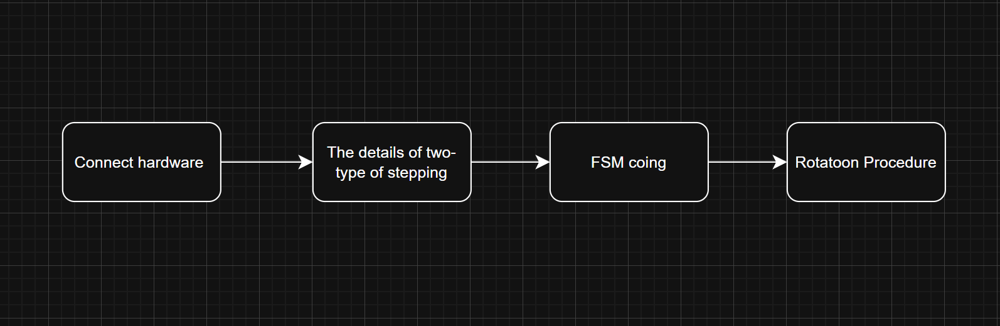

### Requirement

**Hardware**

- MCU
  
  - NUCLEO-F411RE

- Actuator/Sensor/Others
  
  - 3Stepper Motor 28BYJ-48
  
  - Motor Driver ULN2003 (lab)
  
  - breadboard

**Software**

- Keil uVision, CMSIS, EC_HAL library

### Documentation

You can download header files used in this lab [here](https://github.com/YeChanKimm/EC-ycKim-153/tree/main/include)

To control a stepper motor with user input rpm, bellow files are included:

**`ecStepper2.h`**

You can see the details of the library [here](https://github.com/YeChanKimm/EC-ycKim-153/blob/main/README.md)

## Problem : Stepper Motor with 4-input sequence


Bellow is the flowchart of the problem. 

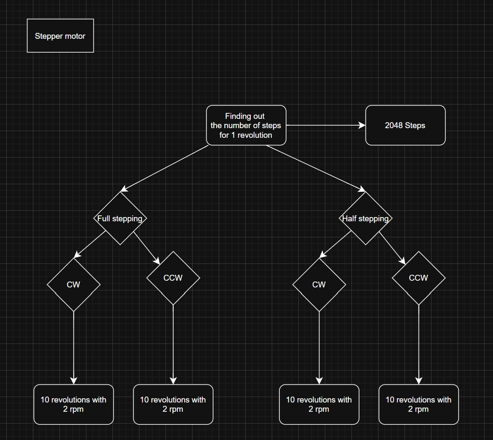

### Hardware Connection

For the lab, stepper motor driver of **ULN2003 motor driver** was used. Bellow is the details of the motor and driver. 

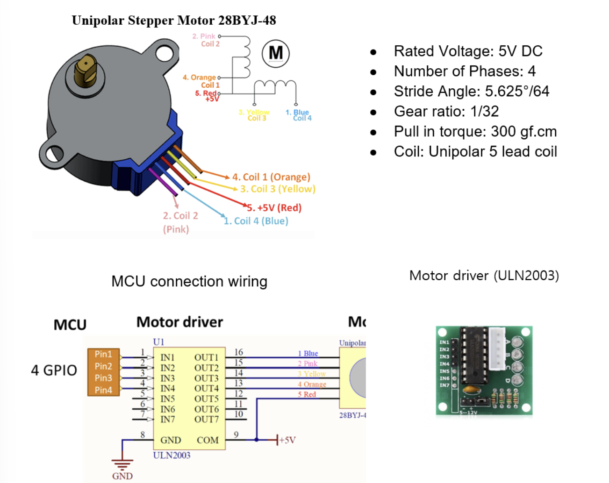

### Stepper Motor Sequence

There are two kinds of Stepper motor stepping:

- **Full stepping**: It energizes two coils at a time, moving the rotor one full step per signal change. It provides maximum torque but lower positional resolution.

- **Half stepping**:  It alternates between energizing one and two coils, effectively dividing each full step into two smaller steps. This doubles the resolution, resulting in smoother motion and finer control, though the torque slightly decreases when only one coil is energized.

#### Full stepping

The sequence of full-stepping is as follows:

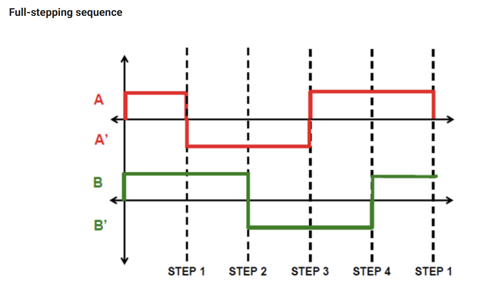

Bellow is the state table of each states. 

| Phase | Port Pin | 1   | 2   | 3   | 4   |
| ----- | -------- | --- | --- | --- | --- |
| A     | PB_10    | H   | L   | L   | H   |
| B     | PB_4     | H   | H   | L   | L   |
| A`    | PB_5     | L   | H   | H   | L   |
| B`    | PB_3     | L   | L   | H   | H   |

#### Half stepping

The sequence of full-stepping is as follows:

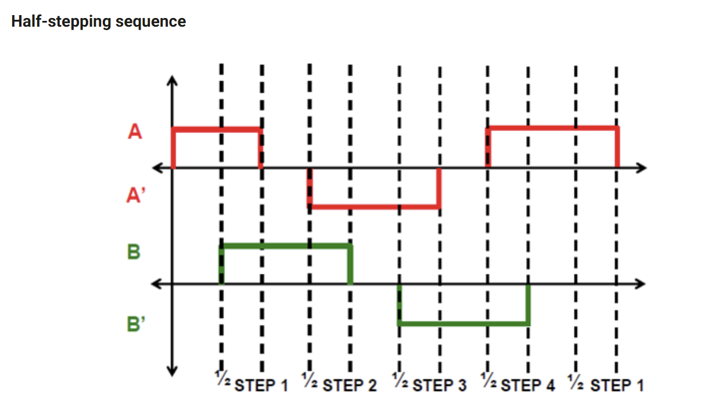

Bellow is the state table of each states.

| Phase | Port Pin | 1   | 2   | 3   | 4   | 5   | 6   | 7   | 8   |
| ----- | -------- | --- | --- | --- | --- | --- | --- | --- | --- |
| A     | PB_10    | H   | H   | L   | L   | L   | L   | L   | H   |
| B     | PB_4     | L   | H   | H   | H   | L   | L   | L   | L   |
| A`    | PB_5     | L   | L   | L   | H   | H   | H   | L   | L   |
| B`    | PB_3     | L   | L   | L   | L   | L   | H   | H   | H   |

### Finite State Machine

Bellow is State table of each FSM. 

**Full stepping**

| State | DIR=1 | DIR=0 | ABA'B' |
| ----- | ----- | ----- | ------ |
| S0    | S1    | S3    | 1100   |
| S1    | S2    | S0    | 0110   |
| S2    | S3    | S1    | 0011   |
| S3    | S0    | S2    | 1001   |

**Half stepping**

| State | DIR=1 | DIR=0 | ABA'B' |
| ----- | ----- | ----- | ------ |
| S0    | S1    | S7    | 1000   |
| S1    | S2    | S0    | 1100   |
| S2    | S3    | S1    | 0100   |
| S3    | S4    | S2    | 0110   |
| S4    | S5    | S3    | 0010   |
| S5    | S6    | S4    | 0011   |
| S6    | S7    | S5    | 0001   |
| S7    | S0    | S6    | 1001   |

### Circuit Diagram

Bellow is circuit diagram of this lab.

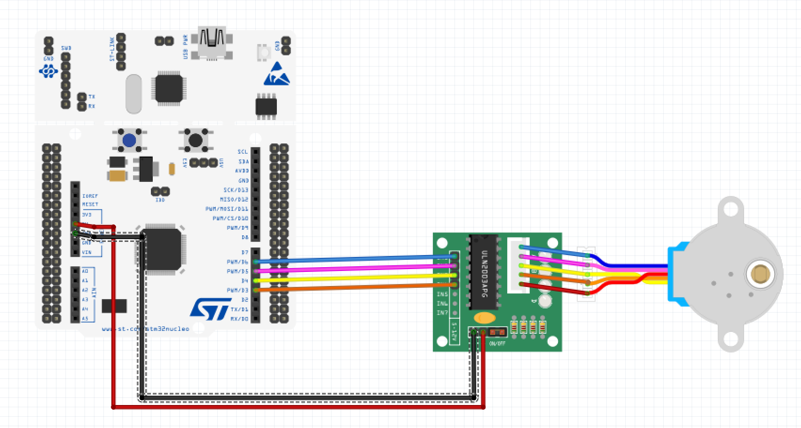

### Configuration

| Digital Out                                                          | SysTick |
| -------------------------------------------------------------------- | ------- |
| PB10, PB4, PB5, PB3<br/>NO Pull-up, Pull-down<br/>Push-Pull<br/>Fast | delay() |

### Procedure

The environment of the problem is as follows:

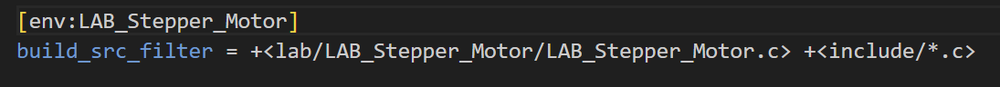

 

To find the number of steps required to rotate 1 revolution, angle per step and gear ratio of the motor is needed:

**Motor information**

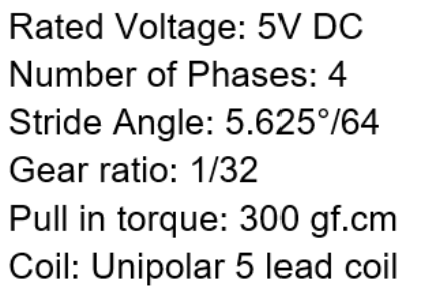

**Motor driver information**

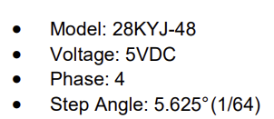

According to the given specifications, the motor has a gear ratio of 1/32, meaning 32 rotations of the motor correspond to one rotation of the output shaft. In addition, since the step angle is 5.625° (1/64), the motor completes a full 360° rotation in 64 steps. Combining these factors, it can be concluded that one revolution of the output shaft requires 32 × 64 = **2048 steps**.

To verify this result, bellow Full-stepping test code was used:

`Full stepping test`

```c
void setup(void);

int main(void) { 
    // Initialiization -------------------------------------------------------
    setup();
    Stepper_step(2048, 0, FULL);  // (Step : 2048, Direction : 0 or 1, Mode : FULL or HALF)

    // Inifinite Loop ----------------------------------------------------------
    while(1){;}
}
// Initialiization 
void setup(void){

    RCC_PLL_init();                                 // System Clock = 84MHz
    SysTick_init(1);                                 // Systick init

    Stepper_init(PB_10,PB_4,PB_5,PB_3);             // Stepper GPIO pin initialization
    Stepper_setSpeed(2);                              //  set stepper motor speed

}
```

The vaule of 2048 steps per revolution was correct, and you can see the result at **Result** section. 

**`Header file`**

First, the only header file included in the code is `ecSTM32F4v2.h`.

```c
#include "ecSTM32F4v2.h"
```

This file contains the declarations of the header files required for the project, and the list of those header files is as follows.

- `ecPinNames.h`
- `ecRCC2.h`
- `ecGPIO2.h`
- `ecEXTI2.h`
- `ecSysTick2.h`
- `ecTIM2.h`
- `ecPWM2.h`
- `ecStepper2.h`

You can see the details of `ecSTM32F4v2.h` [here](https://github.com/YeChanKimm/EC-ycKim-153/blob/main/include/ecSTM32F4v2.h) or Appendix of this report.

**`setup()`**

In the `setup()` function, the PLL is initialized to configure the system clock, and the SysTick timer is set up for delay operations. The stepper motor pins used in this lab—PB_10, PB_4, PB_5, and PB_3—are initialized, and the motor speed is set to 2 RPM.

```c
//Stepping mode

//change the mode
int mode=FULL;
//int mode=HALF;

//Number of revolutions
uint8_t revolution=10;

//Input rpm speed
int rpm_speed=2;

//Speed scaler. Full:1, Half:2
int speed_multiplier=0;

void setup(void){

    RCC_PLL_init();        // System Clock = 84MHz
    SysTick_init(1);      // Systick init

    Stepper_init(PB_10,PB_4,PB_5,PB_3); // Stepper GPIO pin initialization
    Stepper_setSpeed(speed_multiplier*rpm_speed);                              //  set stepper motor speed
    mode_changing();                    //choose full stepping or half stepping                  
}
```

Compared to the previous library, bellow functions were additionally defined and used:

- `Stepper_init()`

- `Stepper_setSpeed()`

You can see the detail above functions in my library [here](https://github.com/YeChanKimm/EC-ycKim-153/tree/main)

For global variables, user can input the motor parameters:

- Stepping mode

- Number of revolution

- rpm speed

In addition, a simple function `mode_changing()` is added:

```c
void mode_changing(void)
{
    //FULL_PULSE_PER_ROTATION: 2048, HALF_PULSE_PER_ROTATION: 4096
    if(mode==FULL) 
    {
        pulse_per_rev=FULL_PULSE_PER_ROTATION;
        speed_multiplier=1;
    }

    else if(mode==HALF) 
    {
        pulse_per_rev=HALF_PULSE_PER_ROTATION;
        speed_multiplier=2        ;
     }

}
```

It changes a gloabal variable `pulse_per_rev` and `speed_multiplier`, which is needed number of pulse of each stepping mode and speed scaler. The state transition speed in the FSM remains the same regardless of the stepping mode. However, in full-step mode, one step is completed after 4 state changes, whereas in half-step mode, it requires 8 state changes for one step. Therefore, to maintain the same rotational speed corresponding to the given RPM regardless of the mode, the revolution per step must be doubled in half-step mode.

**`main()`**

In the main function, the `Stepper_step()` function is used to rotate the motor. The `Stepper_step()` function changes the FSM state according to the direction (DIR) and switches the polarity of the coils inside the motor. 

```c
int main(void) { 
    // Initialiization --------------------------------------------------------
    setup();
    Stepper_step(revolution*pulse_per_rev, 0, mode);  // (Step : 2048, Direction : 0 or 1, Mode : FULL or HALF)

    // Inifinite Loop ----------------------------------------------------------
    while(1){;}
}
```

### Result

1. **Finding the number of steps required to rotate 1 revolution**
   
   | 0step                    | 1024step                 | 2048step                 |
   | ------------------------ | ------------------------ | ------------------------ |
   | 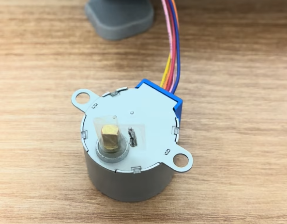 | 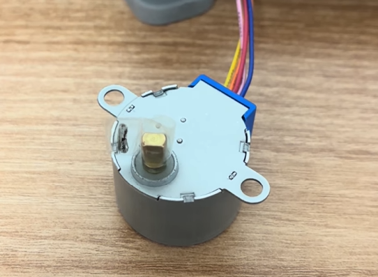 | 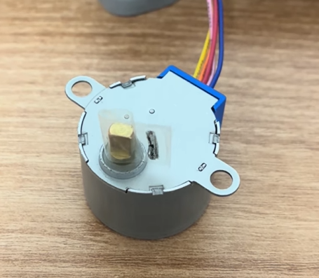 |
   
   Demo video is [here](https://youtube.com/shorts/rjgLmhhmeNQ?si=3Rh8E1WOv9jjgQbA)

2. **Rotate the stepper motor 10 revolutions with 2 rpm for both directions**
   
   **Full-step**
   
   - CCW direction demo video is [here](https://youtu.be/reOrlnJ7QmE?si=tldhD4bs-9ykKxyr)
   
   - CW direction demo video is [here](https://youtu.be/2wuFDr5r4GA?si=fdnyhivzT44Dl7nk)
   
   **Half-step**
   
   - CCW direction demo video is [here](https://youtu.be/klc3bctAQT4?si=S138Id8bOXDxATtf)
   
   - CW direction demo video is [here]()

3. **Check the maximum and minimum rotational speeds of the motor.**
   
   - Maximum: 14.9999...rpm
   
   - Minimum: 1rpm
     
     Demo video is [here](https://youtube.com/shorts/H2_d2O6PWSc?si=vae2VnczSbopEOuD)

### Discussion

Overall, the previously established goals were successfully achieved. We determined the number of steps required for the motor to complete one revolution and tested the motor's rotation in both directions using both full step and half step modes.

However, a problem with speed accuracy arose during this process. A subtle difference was observed between the target RPM (revolutions per minute) and the actual speed of rotation. Although the precise cause of this issue could not be definitively identified, we hypothesize it might be attributable to factors such as energy loss due to frictio or the inaccuracy of the PLL used for the system clock.

Furthermore, upon comparing full stepping and half stepping, we confirmed that half stepping rotated the motor much more smoothly. We determined this was due to the increased resolution in half stepping; since the internal magnetic position of the coils changes more frequently compared to full stepping, it resulted in a visually smoother motion.

Bellow is additional questions:

1. **Find out the trapezoid-shape velocity profile for a stepper motor. When is this profile necessary?**
   
   Bellow is trapezoid-shape velocity profile:
   
   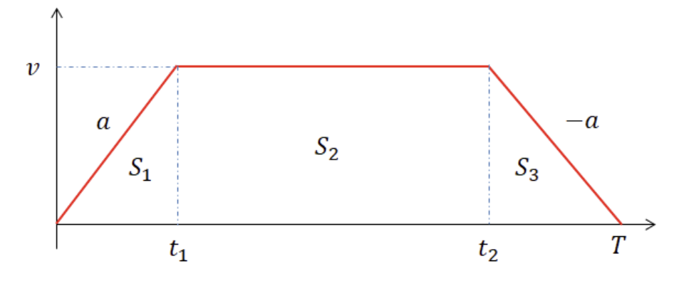 
   
   A stepper motor may experience step loss if its speed changes abruptly, so acceleration and deceleration phases are introduced to gradually adjust the speed. This is called a trapezoidal velocity profile. It is used to achieve precise position control and to suppress vibration and resonance.

2. **How would you change the code more efficiently for micro-stepping control? You don’t have to code this but need to explain your strategy.**
   
   In this lab, the motor is controlled by implementing delays in the main function between steps, utilizing the PLL and a SysTick interrupt. While this method is generally sufficient for modes with relatively large pulse widths, such as Full/Half stepping, Microstepping requires a more sophisticated interrupt scheme. Furthermore, since the entire algorithm currently resides within the main function, the CPU may operate inefficiently. Bellow is main algorithm which is in `main()`:
   
   ```c
   void Stepper_step(uint32_t steps, uint32_t direction, uint32_t mode){
        uint32_t state = 0;
        myStepper._step_num = steps;
   
        for(; myStepper._step_num > 0; myStepper._step_num--){ // run for step size
               delay_ms(step_delay);                  
               if (mode == FULL)                                                          
               state =FSM_full[state].next[direction];// YOUR CODE       // state = next state
           else if (mode == HALF) 
               state = FSM_half[state].next[direction];// YOUR CODE       // state = next state        
           Stepper_pinOut(state, mode);
   
           if(mode==FULL)
           {
               if(myStepper._step_num%2048==0) delay_ms(500);
           }
   
           else if(mode==HALF)
           {
               if(myStepper._step_num%4096==0) delay_ms(500);
           }
   
          }
   }
   ```

   int main(void) { 
       // Initialiization --------------------------------------------------------
       setup();
       Stepper_step(revolution*pulse_per_rev, 1, mode);  // (Step : 2048, Direction : 0 or 1, Mode : FULL or HALF)

       // Inifinite Loop -------------------------------------------------------
    
       while(1){;}

   }

```
Therefore, more efficient motor control could be achieved by securing a highly precise system clock using the **HSE** oscillator, which is more accurate than the PLL, and by reducing the CPU load through the adjustment of the **PWM duty ratio**.


3. **There are other types of Stepper Motor Drivers that are simple to use, such as you only give one pulse signal and direction, instead of giving 4 pulse signals. Such examples are A4988, DRV 8834, and TB6600 drivers. Compare these motor drivers with ULN2003 in terms of operating method.**

Stepper motor drivers can be broadly classified into two types depending on their control method. The **ULN2003** is a simple transistor array–based driver, where the microcontroller (MCU) directly sends sequential pulse signals to the four coils to control rotation. In this configuration, the MCU must handle all step sequences and timing calculations, allowing only basic control such as full-step or half-step operation. While it is inexpensive and easy to use, it has limitations in high-speed or precise motion control.

In contrast, advanced drivers such as the **A4988**, **DRV8834**, and **TB6600** incorporate internal **microstepping control and H-bridge circuits**, requiring only two input signals from the MCU — **STEP (pulse)** and **DIR (direction)**. These drivers internally generate sinusoidal current waveforms to drive the coils, enabling smooth and precise motion. As a result, the computational load on the MCU is significantly reduced, vibration and noise are minimized, and high-resolution control up to 1/16 or 1/32 microsteps can be achieved.

In summary, the ULN2003 is a **manually controlled driver** where the MCU directly manages coil excitation, while the A4988, DRV8834, and TB6600 are **intelligent drivers** equipped with built-in microstepping logic that automatically handles current control, making them more suitable for **precise and stable stepper motor operation**.

### Appendix

**`ecStepper2.c`**

```c
#include "stm32f4xx.h"
#include "ecStepper2.h"

//State number 
#define S0 0
#define S1 1
#define S2 2
#define S3 3
#define S4 4
#define S5 5
#define S6 6
#define S7 7


// Stepper Motor function
uint32_t direction = 1; 
uint32_t step_delay = 100; 
uint32_t step_per_rev = 64*32;


// Stepper Motor variable
volatile Stepper_t myStepper; 


//FULL stepping sequence  - FSM
typedef struct {
   uint32_t next[2];
 uint8_t out[4];

} State_full_t;

State_full_t FSM_full[4] = {      // 1010 , 0110 , 0101 , 1001
  {{S3,S1},{1,1,0,0}},        // ABA'B'
  {{S0,S2},{0,1,1,0}},
 {{S1,S3},{0,0,1,1}},
 {{S2,S0},{1,0,0,1}},
};

//HALF stepping sequence
typedef struct {
 uint32_t next[2];
 uint8_t out[4];
} State_half_t;

State_half_t FSM_half[8] = {    // 1000 , 1010 , 0010 , 0110 , 0100 , 0101, 0001, 1001
  {{S7,S1},{1,0,0,0}},    
 {{S0,S2},{1,1,0,0}},
 {{S1,S3},{0,1,0,0}},
 {{S2,S4},{0,1,1,0}},
 {{S3,S5},{0,0,1,0}},
 {{S4,S6},{0,0,1,1}},
 {{S5,S7},{0,0,0,1}},
 {{S6,S0},{1,0,0,1}}
};


void Stepper_init(PinName_t pinName1, PinName_t pinName2, PinName_t pinName3, PinName_t pinName4){

 //  GPIO Digital Out Initiation
 myStepper.pin1 = pinName1;
 // Repeat for port2,pin3,pin4 
 myStepper.pin2 = pinName2;
 myStepper.pin3 = pinName3;
 myStepper.pin4 = pinName4;

 //  GPIO Digital Out Initiation
 // No pull-up Pull-down , Push-Pull, Fast    
 // Pin1 ~ Pin4
 GPIO_init(myStepper.pin1,OUTPUT);
 GPIO_init(myStepper.pin2,OUTPUT);
 GPIO_init(myStepper.pin3,OUTPUT);
 GPIO_init(myStepper.pin4,OUTPUT);

 //PUPD
 GPIO_pupd(myStepper.pin1,NO_PUPD);
 GPIO_pupd(myStepper.pin2,NO_PUPD);
 GPIO_pupd(myStepper.pin3,NO_PUPD);
 GPIO_pupd(myStepper.pin4,NO_PUPD);

 //output type
 GPIO_otype(myStepper.pin1, PUSH_PULL);
 GPIO_otype(myStepper.pin2, PUSH_PULL);
 GPIO_otype(myStepper.pin3, PUSH_PULL);
 GPIO_otype(myStepper.pin4, PUSH_PULL);

 //speed
 GPIO_ospeed(myStepper.pin1, FAST_SPEED);
 GPIO_ospeed(myStepper.pin2, FAST_SPEED);
 GPIO_ospeed(myStepper.pin3, FAST_SPEED);
 GPIO_ospeed(myStepper.pin4, FAST_SPEED);

}


void Stepper_pinOut (uint32_t state, uint32_t mode){    
    if (mode == FULL){         // FULL mode
     GPIO_write(myStepper.pin1, (FSM_full[state].out[0]));
     GPIO_write(myStepper.pin2, (FSM_full[state].out[1]));
     GPIO_write(myStepper.pin3, (FSM_full[state].out[2]));
     GPIO_write(myStepper.pin4, (FSM_full[state].out[3]));

 }     
  else if (mode == HALF){    // HALF mode
     GPIO_write(myStepper.pin1, (FSM_half[state].out[0]));
     GPIO_write(myStepper.pin2, (FSM_half[state].out[1]));
     GPIO_write(myStepper.pin3, (FSM_half[state].out[2]));
     GPIO_write(myStepper.pin4, (FSM_half[state].out[3]));
 }
}


void Stepper_setSpeed (long whatSpeed){      // rpm [rev/min]
      step_delay = 60000/(step_per_rev*whatSpeed);  // Convert rpm to  [msec/step] delay
     //step_delay = 100*whatSpeed;
}


void Stepper_step(uint32_t steps, uint32_t direction, uint32_t mode){
  uint32_t state = 0;
  myStepper._step_num = steps;

  for(; myStepper._step_num > 0; myStepper._step_num--){ // run for step size
         delay_ms(step_delay);                  
         if (mode == FULL)                                                          
         state =FSM_full[state].next[direction];// YOUR CODE       // state = next state
     else if (mode == HALF) 
         state = FSM_half[state].next[direction];// YOUR CODE       // state = next state        
     Stepper_pinOut(state, mode);

     if(mode==FULL)
     {
         if(myStepper._step_num%2048==0) delay_ms(500);
     }

     else if(mode==HALF)
     {
         if(myStepper._step_num%4096==0) delay_ms(500);
     }

    }
}


void Stepper_stop (void){ 
     myStepper._step_num = 0;    
 // All pins(A,AN,B,BN) set as DigitalOut '0'
 GPIO_write(myStepper.pin1, 0);
 GPIO_write(myStepper.pin2, 0);
 GPIO_write(myStepper.pin3, 0);
 GPIO_write(myStepper.pin4, 0);
}
```

**`LAB_Stepper_Motor.c`**

```c
#include "ecSTM32F4v2.h"

//Stepping mode
int mode=HALF;

//Pulse per rotation
int pulse_per_rev=FULL_PULSE_PER_ROTATION;

//Number of revolutions
uint8_t revolution=10;

//Input rpm speed
int rpm_speed=14.9999;

//Speed scaler. Full:1, Half:2
int speed_multiplier=0;


void setup(void);
void mode_changing(void);
int main(void) { 
    // Initialiization --------------------------------------------------------
    setup();
    Stepper_step(revolution*pulse_per_rev, 1, mode);  // (Step : 2048, Direction : 0 or 1, Mode : FULL or HALF)

    // Inifinite Loop ----------------------------------------------------------
    while(1){;}
}

// Initialiization 
void setup(void){

    RCC_PLL_init();                                 // System Clock = 84MHz
    SysTick_init(1);                                 // Systick init

    Stepper_init(PB_10,PB_4,PB_5,PB_3);             // Stepper GPIO pin initialization

    mode_changing(); //choose full stepping or half stepping
    Stepper_setSpeed(speed_multiplier*rpm_speed);                              //  set stepper motor speed
}


void mode_changing(void)
{
    //Change pulse per rotation and speed by stepping mode
    if(mode==FULL) 
    {
        pulse_per_rev=FULL_PULSE_PER_ROTATION;
        speed_multiplier=1;
    }
    else if(mode==HALF) 
    {
        pulse_per_rev=HALF_PULSE_PER_ROTATION;
        speed_multiplier=2;
    }    
}
```
