# LAB: Stepper Motor

**Date:** 2025-11-10

**Author:** Yechan Kim

**Github:** [GitHub - YeChanKimm/EC-ycKim-153](https://github.com/YeChanKimm/EC-ycKim-153)

**Demo Video:** [ YouTube_YechanKim](https://www.youtube.com/@%EA%B9%80%EC%98%88%EC%B0%AC%ED%95%99%EB%B6%80%EC%83%9D-q7d)

**PDF version:** 1.1

## Introduction

In this lab, the goal is to create a simple program using input capture mode to measure the distance using an ultrasonic distance sensor. The sensor also needs trigger pulses that can be generated by using the timer output. Overall flowchart is as follows:

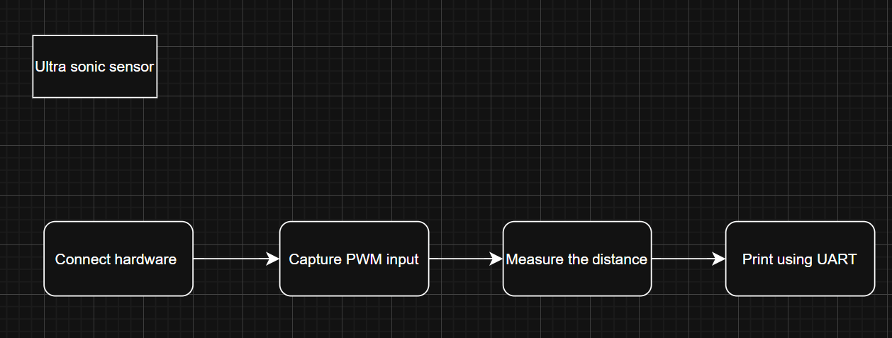

### Requirement

**Hardware**

- MCU
  
  - NUCLEO-F411RE

- Actuator/Sensor/Others
  
  - HC-SR04
  
  - breadboard

**Software**

- Keil uVision, CMSIS, EC_HAL library

### Documentation

You can download header files used in this lab [here](https://github.com/YeChanKimm/EC-ycKim-153/tree/main/include)

To control a stepper motor with user input rpm, bellow files are included:

**`ecICAP2.h`**

**`ecUART2.h`**

You can see the details of the library [here](https://github.com/YeChanKimm/EC-ycKim-153/blob/main/README.md)

## Problem : Ultrasonic Distance Sensor (HC-SR04)

Bellow is the flowchart of the problem. 

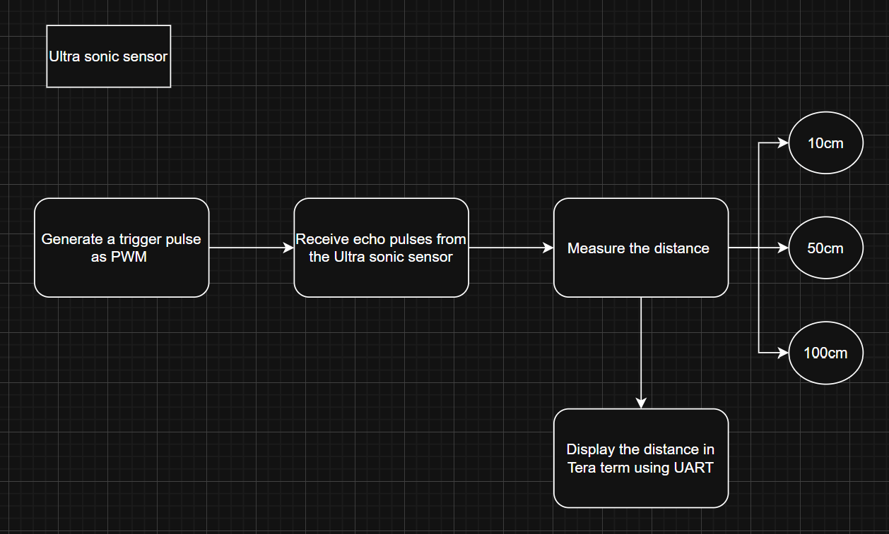

### Hardware Features

For the lab,Ultrasonic Distance Sensor of HC-SR04 was used. Bellow is the details of the  sensor. 

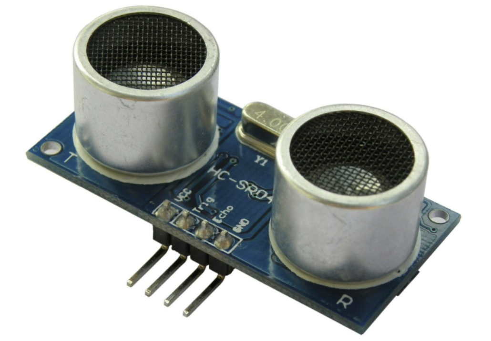

**The HC-SR04 Ultrasonic Range Sensor Features:**

- Input Voltage: 5V

- Current Draw: 20mA (Max)

- Digital Output: 5V

- Digital Output: 0V (Low)

- Sensing Angle: 30° Cone

- Angle of Effect: 15° Cone

- Ultrasonic Frequency: 40kHz

- Range: 2cm - 400cm

### Circuit diagram

Bellow is circuit diagram of this lab.

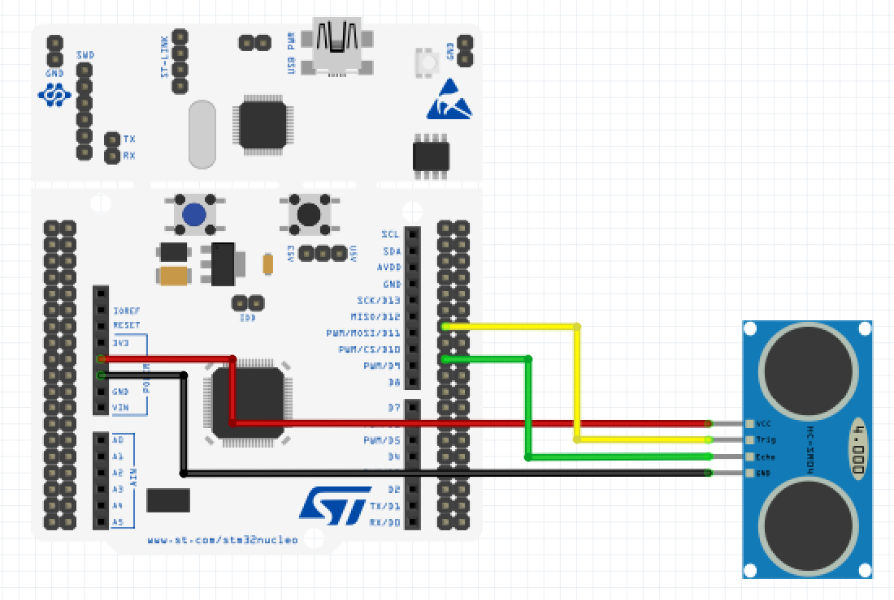

### Configuration

| System Clock                         | PWM                           | Input Capture  |
| ------------------------------------ | ----------------------------- | -------------- |
| PLL (84MHz)                          | PA6 (TIM3_CH1)                | PB6 (TIM4_CH1) |
|                                      | AF, Push-Pull,                |                |
| <br/>No Pull-up Pull-down, Fast      | AF, No Pull-up Pull-down      |                |
|                                      | PWM period: 50msec            |                |
| <br/>pulse width: 10usec             | Counter Clock : 0.1MHz (10us) |                |
| <br/>CH1 -> TI1 -> IC1 (rising edge) |                               |                |
| <br/>CH1 ->TI1 -> IC2 (falling edge) |                               |                |

### Procedure

The environment of the problem is as follows:

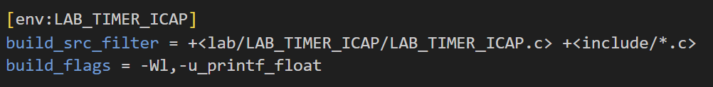

 To print `float` on `Tera Term`, `printf_float` build flag was added. 

**`Header file`**

First, the only header file included in the code is `ecSTM32F4v2.h`.

```c
#include "ecSTM32F4v2.h"
```

This file contains the declarations of the header files required for the project, and the list of those header files is as follows.

- `ecPinNames.h`
- `ecRCC2.h`
- `ecGPIO2.h`
- `ecEXTI2.h`
- `ecSysTick2.h`
- `ecTIM2.h`
- `ecPWM2.h`
- `ecUART2.h`
- `ecICAP2.h`

You can see the details of `ecSTM32F4v2.h` [here](https://github.com/YeChanKimm/EC-ycKim-153/blob/main/include/ecSTM32F4v2.h) or Appendix of this report.

**`setup()`**

Bellow is `setup()` function:

```c
void setup(){
    RCC_PLL_init(); 
    SysTick_init(1);
    UART2_init();

// PWM configuration ---------------------------------------------------------------------    
    PWM_init(TRIG);            // PA_6: Ultrasonic trig pulse
    GPIO_otype(TRIG,PUSH_PULL);
    GPIO_pupd(TRIG, NO_PUPD);
    GPIO_ospeed(TRIG,FAST_SPEED);
    PWM_period_us(TRIG, 50000);    // PWM of 50ms period. Use period_us()
    PWM_pulsewidth_us(TRIG, 10);   // PWM pulse width of 10us


// Input Capture configuration -----------------------------------------------------------------------    
    ICAP_init(ECHO);        // PB_6 as input caputre
    GPIO_pupd(ECHO, NO_PUPD);
     ICAP_counter_us(ECHO, 10);       // ICAP counter step time as 10us
    ICAP_setup(ECHO, 1, IC_RISE);  // TIM4_CH1 as IC1 , rising edge detect
    ICAP_setup(ECHO, 2, IC_FALL);  // TIM4_CH1 as IC1 , rising edge detect
  // TIM4_CH1 as IC2 , falling edge destect
}
```

First, to print the distance measured through the sensor, `UART2_init()` is called. In this function, `PA_2` is set as GPIO TX, and `PA_3` is as GPIO RX. 

bellow is `UART2_init()`:

```c
void UART2_init(void){
    // ********************** USART 2 ***************************
    // PA2 = USART2_TX
    // PA3 = USART2_RX
    // Alternate function(AF7), High Speed, Push pull, Pull up
    // **********************************************************
    USART_setting(USART2, PA_2, PA_3, 9600);
}
```

And to trigger input capture, PWM is generated on `PA_6` pin. the pulse width of the trigger is set as `10us`.  

Bellow is PWM configuration:

```c
// PWM configuration ---------------------------------------------------------------------    
    PWM_init(TRIG);            // PA_6: Ultrasonic trig pulse
    GPIO_otype(TRIG,PUSH_PULL);
    GPIO_pupd(TRIG, NO_PUPD);
    GPIO_ospeed(TRIG,FAST_SPEED);
    PWM_period_us(TRIG, 50000);    // PWM of 50ms period. Use period_us()
    PWM_pulsewidth_us(TRIG, 10);   // PWM pulse width of 10us
```

Lastly, `PB_6` pin is set as input capture. It is triggered by both of rising and falling edge, and has `10us` step time, which is same width PWM trigger. 

Bellow is input capture configuration:

```c
// Input Capture configuration -----------------------------------------------------------------------    
    ICAP_init(ECHO);        // PB_6 as input caputre
    GPIO_pupd(ECHO, NO_PUPD);
     ICAP_counter_us(ECHO, 10);       // ICAP counter step time as 10us
    ICAP_setup(ECHO, 1, IC_RISE);  // TIM4_CH1 as IC1 , rising edge detect
    ICAP_setup(ECHO, 2, IC_FALL);  // TIM4_CH1 as IC1 , rising edge detect
  // TIM4_CH1 as IC2 , falling edge destect
```

**`TIM4_IRQHandler()`**

ISR of `TIM4` is used to calculate timespan. 

```c
void TIM4_IRQHandler(void){
    if(is_UIF(TIM4)){                     // Update interrupt
        ovf_cnt ++;                           // overflow count                                    
        clear_UIF(TIM4);                                  // clear update interrupt flag
    }
    if(is_CCIF(TIM4, 1)){                                 // TIM4_Ch1 (IC1) Capture Flag. Rising Edge Detect
        time1 =ICAP_capture(TIM4,1);                                    // Capture TimeStart
        clear_CCIF(TIM4, 1);                // clear capture/compare interrupt flag 
    }                                                      
    else if(is_CCIF(TIM4, 2)){                                     // TIM4_Ch2 (IC2) Capture Flag. Falling Edge Detect
        time2 = ICAP_capture(TIM4,2);                        // Capture TimeEnd
        timeInterval = -(time1-time2+ovf_cnt*(TIM4->ARR+1))*10/1000;     // (10us * counter pulse -> [msec] unit) Total time of echo pulse

        ovf_cnt = 0;                        // overflow reset
        clear_CCIF(TIM4,2);                                  // clear capture/compare interrupt flag 
    }
}
```

bellow is the concept of timespan:

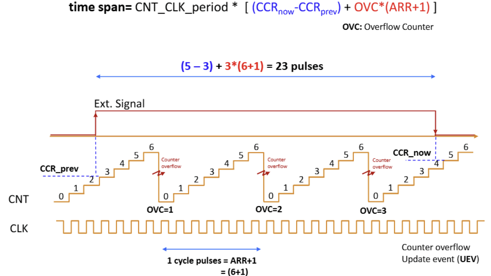

First, to calcultate the number of overflow, `UIF` interrupt is used. `CCR_prev` is stored in `TIM4 CH1`, and `CCR_now` is stored in `TIM4 CH2`. Using these values, timespan is calculated and stored in `timeInterval`. 

**`main()`**

In the main function, it print out the calculated time interval on `Tera Term`. 

```c
int main(void){
    setup();
    while(1){
        distance = (float) timeInterval * 340.0 / 2.0 / 10.0;   // [mm] -> [cm]
        printf("%.2f cm\r\n", distance);
        delay_ms(500);
    }
}
```

### Result

Bellow are results:

**10cm**

| 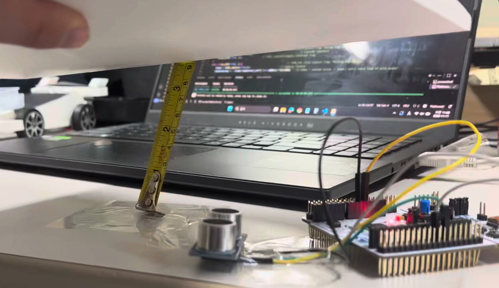 |  |
| --------------------- | --------------------- |


**50cm**

| 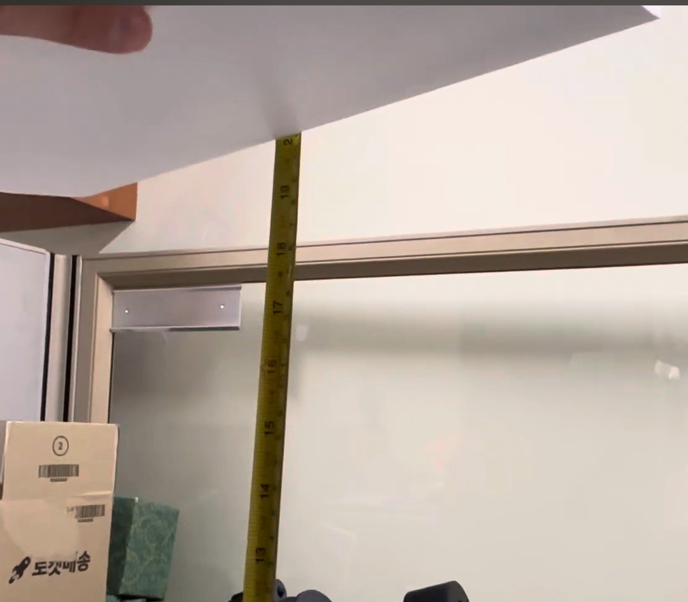 | 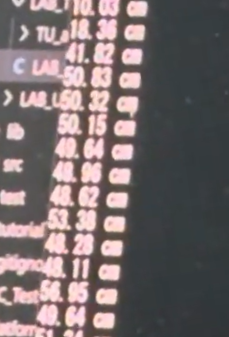 |
| --------------------- | --------------------- |


**100cm**

| 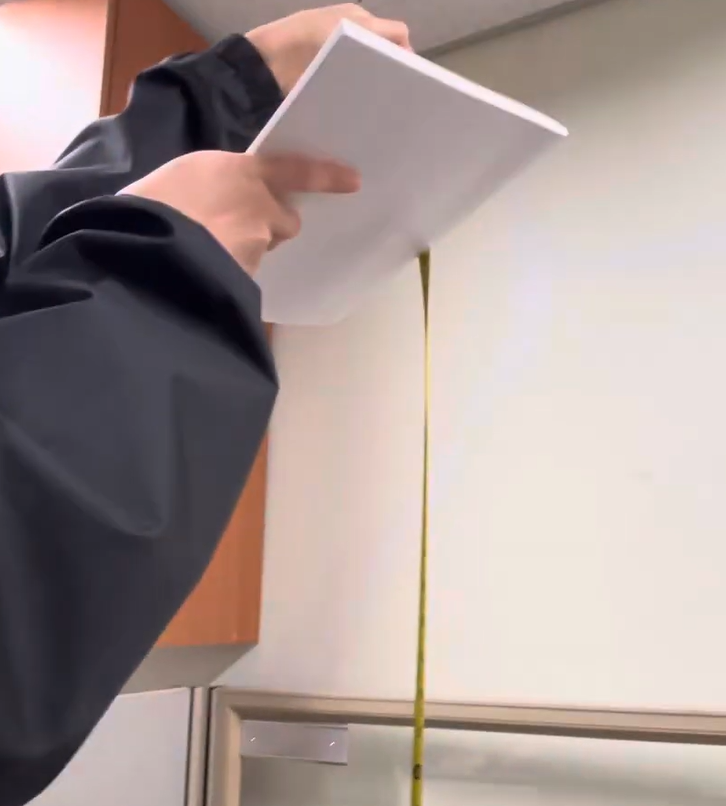 | 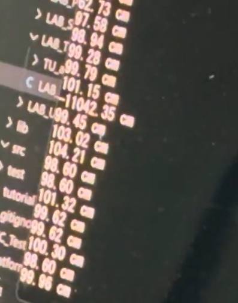 |
| ---------------------- | ---------------------- |

You can also see my demo video [here](https://youtu.be/1RPxLyKZpk4?si=yXAxgXqP3UPOWj0G)

### Discussion

Overall, the Overall, the input capture function worked as intended. However, when the object had gaps or when there was a brief interruption in the input signal, an impulse appeared momentarily in the measured distance values. This indicates that the sensor performs more reliably when detecting objects with a flat surface.

Bellow is given questions:

1. **There can be an over-capture case, when a new capture interrupt occurs before reading the CCR value. When does it occur and how can you calculate the time span accurately between two captures?**
   
   It occurs when the input signal period is shorter than the time it takes to read and process the previous capture interrupt, meaning the timer’s capture/compare register (CCR) is overwritten by a new event before the old value is read.
   
   To handle this and calculate the time span accurately, counting timer overflows between captures is necessary. By combining the captured CCR values with the overflow counter, the total elapsed time can be computed as:
   
   $$
   timespan=CLKPERIOD\times (CCR_(now) -CCR_(prev) + OverflowCount\times(ARR+1)
   $$
   
   Then multiply by the timer’s time base (e.g., 10 µs per tick) to get the actual time difference. This ensures correct timing even if multiple overflows occur between rising and falling edges.

2. **In the tutorial, what is the accuracy when measuring the period of 1Hz square wave? Show your result.**
   
   When running the tutorial code using Arduino, the distance itself was measured correctly; however, during continuous measurement, the readings were less stable compared to when a 1 MHz counter was used.
   
   Bellow is tutorial result:
   
   | 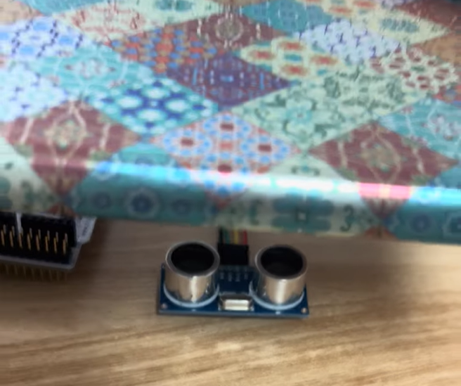 | 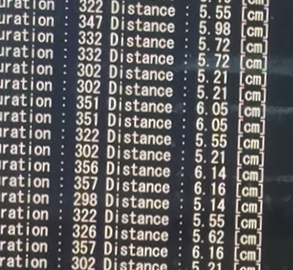 |
   | ---------------------------- | ---------------------------- |

        And You also can see the demo video of the tutorial [here](https://youtube.com/shorts/LqXnG037yd4?si=xy__2gx2mDAX-iZ5)

## Appendix

**`LAB_TIMER_ICAP.c`**

```c
/**
******************************************************************************
* @author  Yechan Kim
* @brief   Embedded Controller:  LAB - Timer Input Capture - with Ultrasonic Distance Sensor
* 
******************************************************************************
*/

#include "stm32f411xe.h"
#include "math.h"
#include "ecSTM32F4v2.h"

uint32_t ovf_cnt = 0;
float distance = 0;
float timeInterval = 0;
float time1 = 0;
float time2 = 0;
float debug=120.2;
#define TRIG PA_6
#define ECHO PB_6


void setup(void);

int main(void){

    setup();

    while(1){
        distance = (float) timeInterval * 340.0 / 2.0 / 10.0;     // [mm] -> [cm]
        printf("%.2f cm\r\n", distance);
        delay_ms(500);
    }
}

void TIM4_IRQHandler(void){
    if(is_UIF(TIM4)){                     // Update interrupt
        ovf_cnt ++;                           // overflow count                                    
        clear_UIF(TIM4);                                  // clear update interrupt flag
    }
    if(is_CCIF(TIM4, 1)){                                 // TIM4_Ch1 (IC1) Capture Flag. Rising Edge Detect
        time1 =ICAP_capture(TIM4,1);                                    // Capture TimeStart
        clear_CCIF(TIM4, 1);                // clear capture/compare interrupt flag 
    }                                                      
    else if(is_CCIF(TIM4, 2)){                                     // TIM4_Ch2 (IC2) Capture Flag. Falling Edge Detect
        time2 = ICAP_capture(TIM4,2);                        // Capture TimeEnd
        timeInterval = -(time1-time2+ovf_cnt*(TIM4->ARR+1))*10/1000;     // (10us * counter pulse -> [msec] unit) Total time of echo pulse

        ovf_cnt = 0;                        // overflow reset
        clear_CCIF(TIM4,2);                                  // clear capture/compare interrupt flag 
    }
}

void setup(){
    RCC_PLL_init(); 
    SysTick_init(1);
    UART2_init();

// PWM configuration ---------------------------------------------------------------------    
    PWM_init(TRIG);            // PA_6: Ultrasonic trig pulse
    GPIO_otype(TRIG,PUSH_PULL);
    GPIO_pupd(TRIG, NO_PUPD);
    GPIO_ospeed(TRIG,FAST_SPEED);
    PWM_period_us(TRIG, 50000);    // PWM of 50ms period. Use period_us()
    PWM_pulsewidth_us(TRIG, 10);   // PWM pulse width of 10us


// Input Capture configuration -----------------------------------------------------------------------    
    ICAP_init(ECHO);        // PB_6 as input caputre
    GPIO_pupd(ECHO, NO_PUPD);
     ICAP_counter_us(ECHO, 10);       // ICAP counter step time as 10us
    ICAP_setup(ECHO, 1, IC_RISE);  // TIM4_CH1 as IC1 , rising edge detect
    ICAP_setup(ECHO, 2, IC_FALL);  // TIM4_CH1 as IC1 , rising edge detect
  // TIM4_CH1 as IC2 , falling edge destect
}
```
